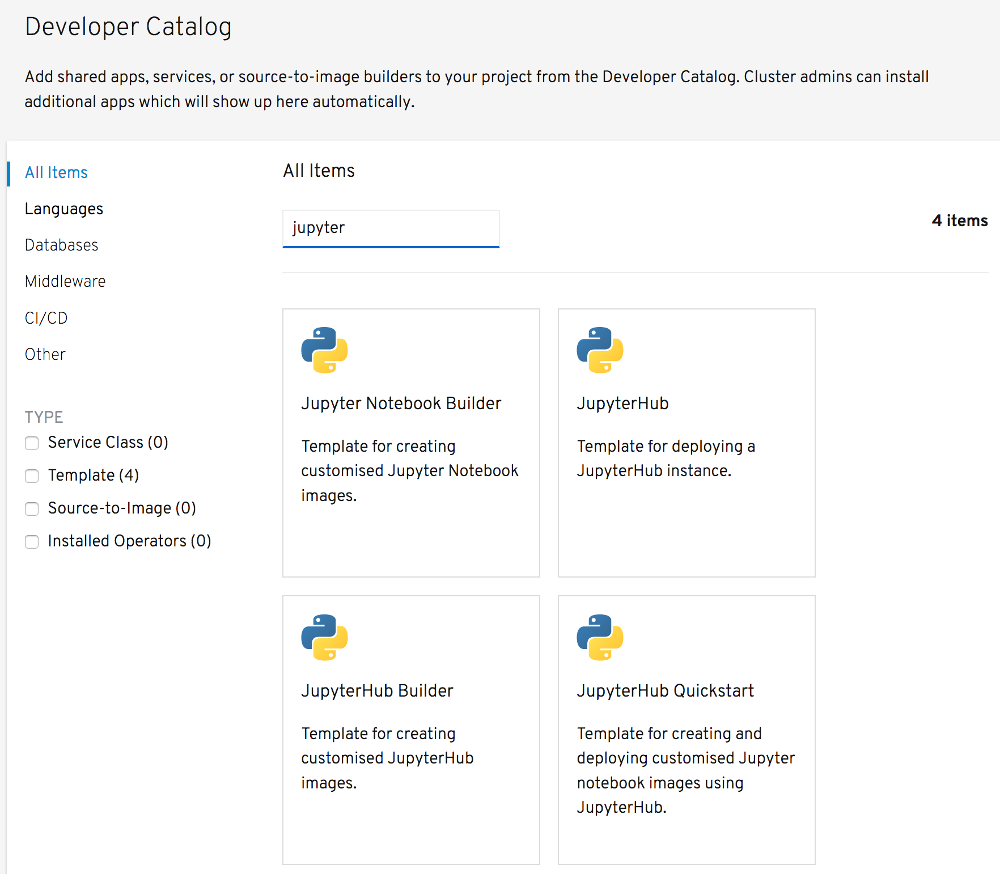
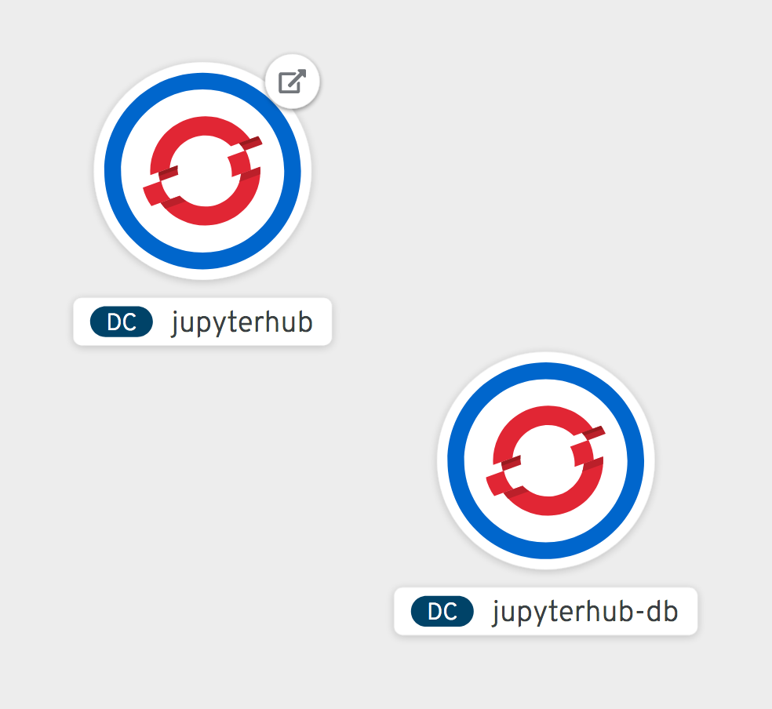

From the options for deploying applications to your project, select _From Catalog_. This will bring up the _Developer Catalog_.

Ensure that _All Items_ is selected on the left hand side, and in the _Filter by keyword_ text entry field enter ``jupyter``{{copy}}. This will limit the displayed items to just the OpenShift templates you loaded.

Click on the tile for _JupyterHub_.

This will bring up the description of the template. Click on _Instantiate Template_, which will bring up a form with the parameters for the template which you can customize.

The purpose of the template parameters are:

* ``APPLICATION_NAME`` - The name of the deployment.
* ``JUPYTERHUB_IMAGE`` - The name of the image stream for the JupyterHub image, and the version tag, which you wish to use.
* ``NOTEBOOK_IMAGE`` - The name of the image stream for the Jupyter notebook image, and the version tag, which you wish to use.
* ``JUPYTERHUB_CONFIG`` - Contents for a custom `jupyterhub_config.py` file to override any JupyterHub defaults.
* ``JUPYTERHUB_ENVVARS`` - Contents for a shell script to be executed to set any special environment variables to customise the JupyterHub deployment.
* ``DATABASE_PASSWORD`` - Password for accessing the database used by JupyterHub.
* ``COOKIE_SECRET`` - Secret used with cookies to encode information about the JupyterHub session.
* ``JUPYTERHUB_MEMORY`` - The maximum amount of memory the JupyterHub deployment is allowed to use.
* ``DATABASE_MEMORY`` - The maximum amount of memory the JupyterHub database application is allowed to use.
* ``NOTEBOOK_MEMORY`` - The maximum amount of memory each Jupyter noteboook deployment is allowed to use.

For this example, you can leave all the fields as there default values. This means we will use an empty Jupyter notebook image. You could instead use the ``notebook-builder`` template to first build your own custom Jupyter notebook image and use it instead.

Click on _Create_. The _Template Instance Overview_ view for the deployment will be displayed.

To monitor the deployment, click on the _Topology_ view in the left hand side menu.

You will see two deployments, one for JupyterHub and one for a PostgreSQL database it uses to store information.

The rings shown in the visualization for the deployments will change from white, indicating a deployment is pending, to light blue, indicating the application is starting, and finally blue, indicating the application is running.

The icon top right of the ring for the JupyterHub deployment is a short cut to access the URL for the deployment. Once the ring has turned blue indicating the application is running, click on this icon, which will open a new browser tab or window.

Because a secure HTTP connection is used, but an environment may in some cases use a self signed SSL certificate, you will need to accept the certificate to proceed.

In this deployment of JupyterHub, user authentication is not required and you will be assigned a temporary identity.

What you will see is a progress screen as a separate Jupyter notebook instance is started up for you. Once the instance has started, you will have access to the Jupyter notebook file browser.

At this point you can create new notebooks or upload existing notebooks. If you need to install additional Python packages, when using this type of deployment you would need to start a terminal from the Jupyter notebook web interface and install the packages manually.

In this configuration nothing is persistent. If the notebook instance were restarted, you would loose any work.

Because JupyterHub is used to handle spawning of JupyterHub notebook instances on demand, a separate user visiting the same URL, will be given access to their own notebook session.
