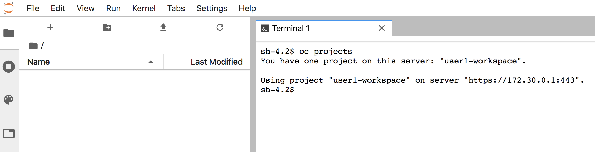

For each user session, a separate pod is created in the same project as JupyterHub is running. It is in this pod that the Jupyter notebook application runs. You can see a list of the pods for the active user sessions by running:

``oc get pod -l component=singleuser-server``{{execute}}

How much memory each user is allowed to use for their Jupyter notebook instance is defined by the ``NOTEBOOK_MEMORY`` template parameter.

Because the ``VOLUME_SIZE`` template parameter was specified, each user will be assigned their own persistent volume. The first time that they start up a Jupyter notebook, files from the Jupyter notebook image will be copied from the image into the persistent volume. Any subsequent changes made to the files will then be written back to the persistent volume. If the Jupyter notebook instance is stopped and then started again, the changes will be preserved.

You can see a list of the persistent volumes claimed for each user session by running:

``oc get pvc -l component=singleuser-storage``{{execute}}

If a user manages to delete all their files, or they want to revert back to the original files from the Jupyter notebook image, they should create the file ``/opt/app-root/.delete-volume`` by running:

``touch /opt/app-root/.delete-volume``

This can be done from a terminal created from the Jupyter notebook web interface. Having created the file, they can visit the JupyterHub _Control Panel_, stop their server instance, and start it again. When it starts again, the file above will trigger the deletion of the contents of the persistent volume and it will be restored to the original contents from the Jupyter notebook image.

If for some reason changes made to the persistent volume prevent the Jupyter notebook instance starting and the file cannot be created, it would be necessary to stop the Jupyter notebook instance as a JupyterHub admin from the JupyterHub admin control panel, and delete the persistent volume claim using the ``oc delete pvc`` command.

When the pod is created for a users Jupyter notebook instance, access from that pod is given to the OpenShift cluster with access rights governed by what user they logged in as.

The user would not have any access to the project the pod is running in, unless they would normally have access to that project.

In this example deployment, because the ``OPENSHIFT_PROJECT`` template parameter was defined as ``{username}-workspace``, a project will be automatically created using that name, where ``{username}`` is replace with the users own name. In this case that would be ``user1-workspace``. You can check this was the case by running:

``oc get project/user1-workspace``{{execute}}

This relied on the user having the ability to create new projects. What workloads they can deploy to the project will be dictated by whatever global resource quotas and limits would be applied to the project for the user.

If a user cannot normally create projects, you can instead pre-create required projects as a cluster admin, setting a per project resource quota, limit ranges, and granting access to the project by the user, or a group of users, as necessary. In this case, as the project will not need to be created, it will just be made the active project for the user.

A user can deploy workloads to the project using the cluster REST API using code running in their notebooks. The Jupyter notebook image also supplies the ``oc`` and ``kustomize`` command line tools, which can be used from a terminal created from the Jupyter notebook interface.

To test access to the cluster, from the Jupyter notebook web interface, create a terminal instance. At the login prompt of the terminal running in the Jupyter notebook, run:

``oc projects``{{copy}}

You will see what projects you can access.

Where the JupyterHub environment was created and a custom Jupyter notebook image was used containing a set of Jupyter notebook files, it could also include an OpenShift template, or set of resources for ``kustomize`` which can then be used to deploy any workloads required for the Jupyter notebook. For example, you might deploy a Dask or Spark cluster within the project right from the Jupyter notebook terminal interface.

If you need to know the name of any associated project, you can work out the name from the ``PROJECT_NAMESPACE`` environment variable. This will be available in both the Jupyter notebook and terminal.
