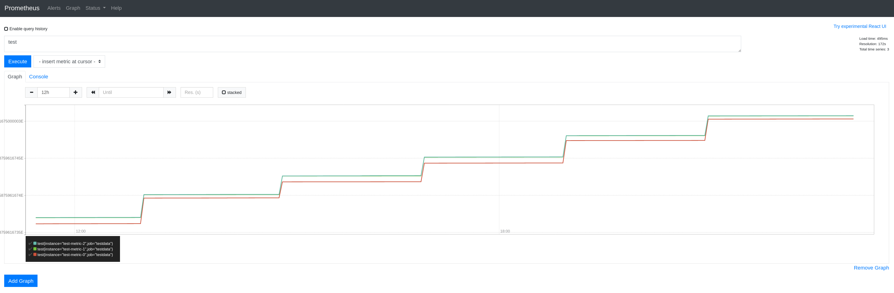
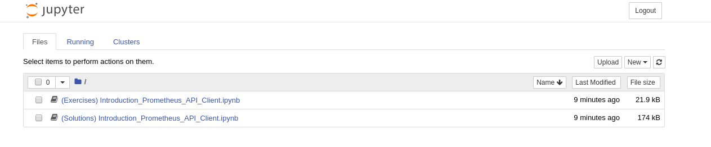

### Waiting for the test data to be generated
We need to generate some test data for Prometheus which can take a couple of minutes.  
Once the environment is set up, lets see how to access it.

### Accessing the Prometheus Console
* The Prometheus console can be accessed using the following url:  
http://prometheus-demo-route-myproject.[[HOST_SUBDOMAIN]]-80-[[KATACODA_HOST]].environments.katacoda.com/

  

* To check if the test data was generated successfully, go to the following url:  
  http://prometheus-demo-route-myproject.[[HOST_SUBDOMAIN]]-80-[[KATACODA_HOST]].environments.katacoda.com/graph?g0.range_input=12h&g0.expr=test&g0.tab=0

* The above link will query the Prometheus instance for a metric called `test` for the past 12 hours and if the data was generated successfully your Prometheus console should look like this:
  

### Accessing the Jupyter Notebooks Environment

* The Jupyter environment with the workshop notebooks is available here:  
https://prometheus-anomaly-detection-workshop-myproject.[[HOST_SUBDOMAIN]]-80-[[KATACODA_HOST]].environments.katacoda.com/

* You might see a warning like in the image below, this is because we don't generate valid ssl certificates for all our routes. You can click on `Advanced...` and then click on `Accept the Risk and Continue` to continue to the Jupyter environment.

  
  
* You will need a password to access the environment.  
  The password is `secret`{{copy}}  
  

* There are 2 notebooks available in the Jupyter environment:
  1. `(Exercises) Introduction_Prometheus_API_Client.ipynb` - In this notebook you will explore and solve few exercises on using the Prometheus API client.
  2. `(Solutions) Introduction_Prometheus_API_Client.ipynb` - You will find the solutions to the exercises in this notebook.   

  

* The idea behind this scenario is to work through the `Exercises` notebook and only check the solutions notebook when you need help.

That's it, once you are done with the notebooks you have finished this scenario.  
The next step will just show you how to access the backend for this scenario, you can safely skip it.
