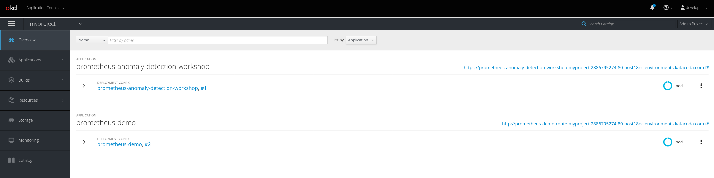

### Accessing the OpenShift Console

You don't need to access the OpenShift Console for the purposes of this workshop.  
But if you want to look at what's going on under the hood, you can follow the instructions below:

To access the OpenShift console:

* Click on the _Dashboard_ tab in the workshop dashboard. You will be presented with the OpenShift login screen.

  

  For the credentials, enter:

  * **Username:** ``developer``{{copy}}
  * **Password:** ``developer``{{copy}}

Once you have logged in, you should be shown the list of projects you have access to. A project called `myproject` is where this workshop is deployed.

* In this project you should be able to see two different applications that have been deployed.  
  

  * The `prometheus-anomaly-detection-workshop` application is the Jupyter notebook environment.

  * The `prometheus-demo` application is the Prometheus instance with the test metric data.

While playing around the backend keep in mind that this environment will only be active for 1 hour.  
The source for this scenario is available [here](https://github.com/openshift-labs/learn-katacoda/tree/master/ai-machine-learning/prometheus-api-client).
