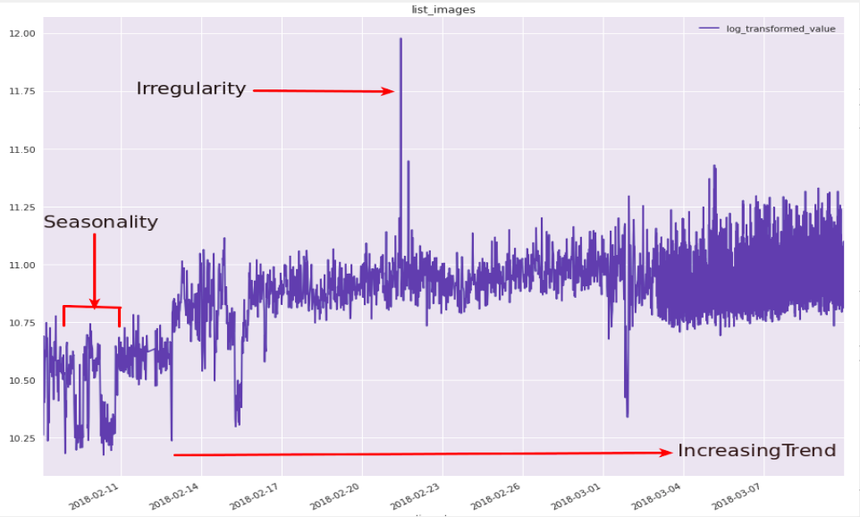

As we saw in the previous scenario, Prometheus metrics are time series data identified by metric name and key/value pairs. With the increased amount of metrics flowing in it is getting harder to see the signals within the noise. The current state of the art is to graph out metrics on dashboards and alert on thresholds. However, we can leverage machine learning algorithms to perform time series forecasting and predict an unusual behavior or pattern in the metrics. The predicted values from the model can be compared with the actual metric values and if they differ from the default threshold values, we can flag it as an anomaly.

## What is Time Series Forecasting?
A time series is a sequence of observations taken sequentially in time. Time series adds an explicit order dependence between observations: a time dimension. This additional dimension is both a constraint and a structure that provides a source of additional information.

We have different goals depending on whether we are interested in understanding a dataset or making predictions.
Making predictions about the future is called extrapolation in the classical statistical handling of time series data. More modern fields focus on the topic and refer to it as time series forecasting. Forecasting involves taking models fit on historical data and using them to predict future observations. An important distinction in forecasting is that the future is completely unavailable and must only be estimated from what has already happened. The skill of a time series forecasting model is determined by its performance at predicting the future. This is often at the expense of being able to explain why a specific prediction was made, confidence intervals and even better understanding the underlying causes behind the problem.

## Components of Time Series
Some important components of time series are:
1. **Level** - The baseline value for the series if it were a straight line
2. **Trend** - The optional and often linear increasing or decreasing behavior of the series over time
3. **Seasonality** - The optional repeating patterns or cycles of behavior over time
4. **Noise** - The optional variability in the observations that cannot be explained by the model

All time series have a level, most have noise, and the trend and seasonality are optional. Assumptions can be made about these components both in behavior and in how they are combined, which allows them to be modeled using traditional statistical methods. These components may also be the most effective way to make predictions about future values, but not always

## Concerns of Forecasting
When forecasting, it is important to understand your goal and ask lots of questions to help zoom in on the specifics of your predictive modeling problem. For example:
* *How much data do you have available and are you able to gather it all together?*
* *What is the time horizon of predictions that is required? Short, medium or long term?*
* *Can forecasts be updated frequently over time or must they be made once and remain static?*
* *At what temporal frequency are forecasts required?*

Time series data often requires cleaning, scaling, and even transformation.

For example:

* **Frequency** - Perhaps data is provided at a frequency that is too high to model or is unevenly spaced through time requiring resampling for use in some models
* **Outliers** - Perhaps there are corrupt or extreme outlier values that need to be identified and handled
* **Missing** - Perhaps there are gaps or missing data that need to be interpolated or imputed

## SARIMA model for Time Series Forecasting
In this notebook, we will explore how to train a SARIMA (Seasonal AutoRegressive Integrated Moving Average) model for predicting anomalies on sample metric data. (S)ARIMA models are among the most widely used approaches for time series forecasting. In an **AutoRegressive** model the forecasts correspond to a linear combination of past values of the variable. In a **Moving Average** model the forecasts correspond to a linear combination of past forecast errors.

Basically, the ARIMA models combine these two approaches. Since they require the time series to be stationary, differencing (Integrating) the time series may be a necessary step, i.e. considering the time series of the differences instead of the original one.

The **SARIMA** model (Seasonal ARIMA) extends the ARIMA by adding a linear combination of seasonal past values and/or forecast errors.

Let us now proceed to the notebook and understand all the necessary steps involved while solving a machine learning problem!
