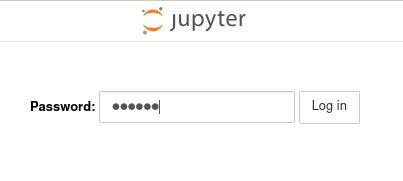
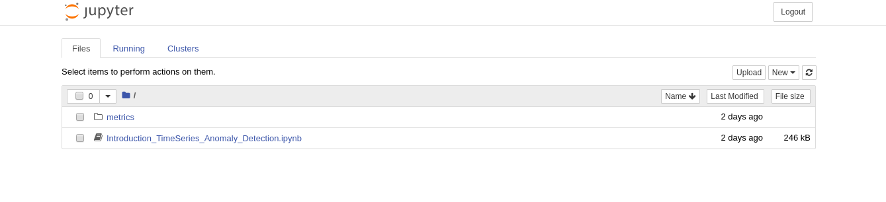

Please wait for a few minutes while the environment loads. (If you want to look at what's going on under the hood, you can go to Step 3 to access the OpenShift console and come back to this step to login to the Jupyter Notebook environment.)

### Accessing the Jupyter Notebook Environment
* The jupyter environment with the workshop notebooks is available here:  
https://pad-workshop-myproject.[[HOST_SUBDOMAIN]]-80-[[KATACODA_HOST]].environments.katacoda.com/

* You might see a warning like in the image below, this is because we don't generate valid ssl certificates for all our routes. You can click on `Advanced...` and then click on `Accept the Risk and Continue` to continue to the Jupyter environment.

  

* You will need a password to access the environment.  
  The password is `secret`{{copy}}  

* Once you login to the Jupyter environment, you will find the following:
  1. `metrics` folder: This contains sample Prometheus metric data sets which we will use in our notebook for training the time series forecasting (SARIMA) model.
  2. `(Exercises) Introduction_TimeSeries_Anomaly_Detection.ipynb`: In this notebook you will explore the sample metric data sets and perform time series forecasting for detecting anomalies.
  3. `(Solutions) Introduction_TimeSeries_Anomaly_Detection.ipynb`: You will find the solutions to the exercises in this notebook.   

Now, spend some time going through the notebook(s) and try out the exercises for yourself to understand time series analysis better!
