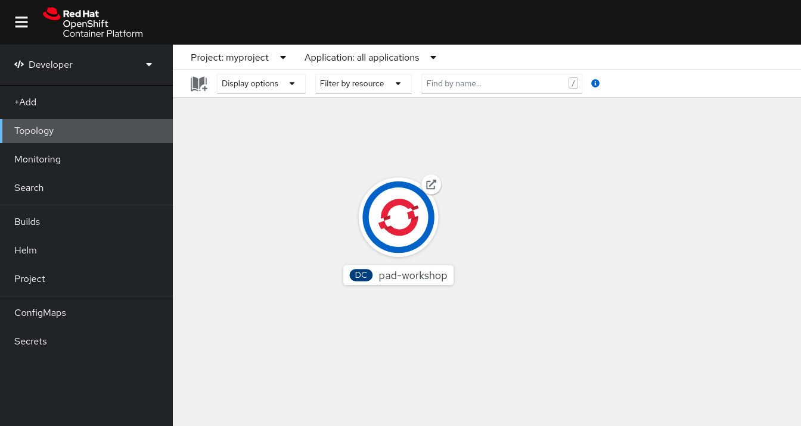

### Accessing the OpenShift console:
You don't need to access the OpenShift Console for this workshop.  
If you want to look at what's going on under thehood, you can follow the instructions below:

To access the OpenShift console:

* Click on the _Dashboard_ tab in the workshop dashboard. You will be presented with the OpenShift login screen.
  
  

For the credentials, enter:

* **Username:** ``developer``{{copy}}
* **Password:** ``developer``{{copy}}

Once you have logged in, you should be shown the list of projects you have access to. A project called ``myproject`` has already been created for you to use in this workshop.

In this project you should be able to see a Jupyter deployment. Once the pod is ready, you can login to the Jupyter environment.

