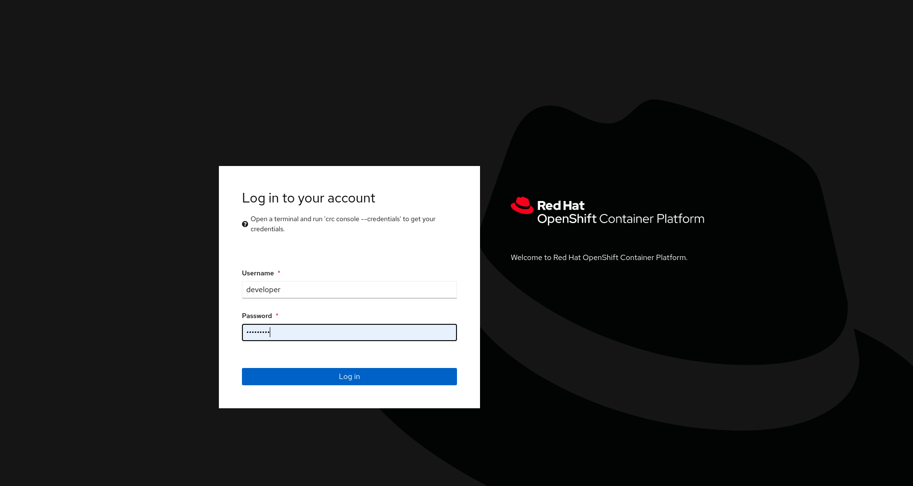

### Accessing the OpenShift Console

You don't need to access the OpenShift Console for the purposes of this workshop.  
But if you want to look at what's going on under the hood, you can follow the instructions below:

To access the OpenShift console:

* Click on the _Console_ tab in the workshop dashboard. You will be presented with the OpenShift login screen.

  

  For the credentials, enter:

  * **Username:** ``developer``{{copy}}
  * **Password:** ``developer``{{copy}}

Once you have logged in, you should be shown the list of projects you have access to. A project called `myproject` is where this workshop is deployed.

You should be able to see the deployment in the OpenShift Web Console by switching over to the **Developer** perspective of the OpenShift Web Console. Change from **Administrator** to **Developer** from the drop-down as shown below:

Make sure you are on the `myproject` project by selecting it from the projects list or **Project** dropdown menu.

In this project you should be able to see a Jupyter deployment. Once the pod is ready, you can login to the Jupyter environment.

Go back to Step 2 if you want to continue playing with the notebooks, else you can proceed to exit this scenario. 
