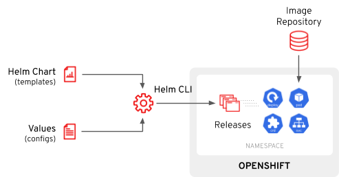

## What you will learn ##

In this self-paced tutorial, you will learn the basics of [Helm 3](https://helm.sh/), a package manager for Kubernetes that helps you managing Kubernetes applications.

In this tutorial, you will:
* Explore `helm` CLI.
* Deploy an `Helm Chart`.
* Create you own `helm chart` and deploy it.
* Understand helm `templating system`.
* Convert helm charts into `Helm Operator` with Operator SDK.

## What is Helm? 

[Helm](https:/helm.sh/) is a package manager for Kubernetes which helps users create templated packages called Helm Charts to include all Kubernetes resources that are required to deploy a particular application.  Helm then assists with installing the Helm Chart on Kubernetes, and afterwards it can upgrade or rollback the installed package when new versions are available. 

When a user instructs the Helm CLI to install a Helm Chart, the information about the Helm Chart is fetched from the repository, rendered on the client and then applied to Kubernetes while a record of this installation is created within the namespace (which is known as a Release)

Helm Charts are particularly useful for installation and upgrade of stateless applications given that the Kubernetes resources and the application image can simply be updated to newer versions. In this scenario, you will also convert your Helm Charts into an Operator, starting using [Operator Framework](https://github.com/operator-framework) for a complete Day 2 experience for your apps.

Helm 3 is GA and available on OpenShift 4.4, removing Tiller depencies like in Helm 2 which was source of major security concerns.

Let's get started!

