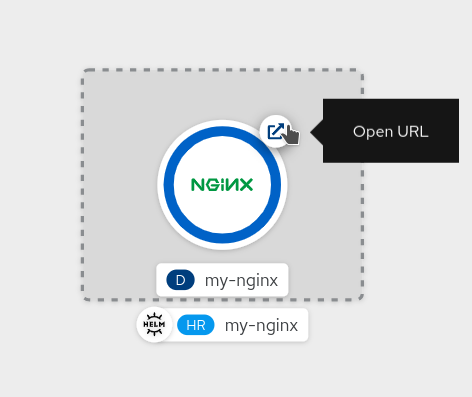

At the end of this chapter you will be able to:
- Use `helm` CLI
- Install `helm repository`
- Search, install and uninstall `Helm Charts`
- Review Helm Charts from `OpenShift Console`

## Helm Command Line Interface (CLI)

In this scenario you will find the Helm CLI already installed for you, which can be retrieved from [GitHub](https://helm.sh/docs/intro/install/).

The CLI is the entry point for any interaction with Helm 3 subsystem. In addition to that, OpenShift UI Developer Catalog, which is the central hub for all developer content, add support for Helm Charts in addition to Operator-backed services, Templates, etc.

## Logging in to the Cluster

To login to the OpenShift cluster from the Terminal run:

`oc login -u developer -p developer`{{execute}}

This will log you in using the credentials:

* **Username:** ``developer``{{copy}}
* **Password:** ``developer``{{copy}}

Use the same credentials to log into the Web Console.

Create a new OpenShift Project to have a namespace for our  helm charts to work with.

`oc new-project helm`{{execute}}

## Exercise: Explore CLI
Let's get started by using `helm` getting CLI version :

`helm version`{{execute}}

This should confirm we are using **Helm 3**.

As discussed in previous step, Helm Charts are available through repositories, and those can be pre-installed or installable by the user.

You can search for Helm Charts available in any public repositories through [Helm Hub](https://hub.helm.sh/).

For instance, searching Helm Charts for [NGINX](https://nginx.com):

`helm search hub nginx`{{execute}}

This will give a list of available charts from multiple repositories, if we want to install it, we need to have such repositories configured.

By default the list of available repositories is empty, you can add a new one with the CLI. For Wordpress, add Bitnami repository:

`helm repo add bitnami https://charts.bitnami.com/bitnami`{{execute}}

Once added, verify it is present:

`helm repo list`{{execute}}

You can search for Helm Charts also inside repos, like in just installed one:

`helm search repo bitnami/nginx`{{execute}}

## Deploy a Helm Chart

You can use `helm install` command to deploy your charts and start managing revisions.
 
To install [NGINX Chart](https://hub.helm.sh/charts/bitnami/nginx):

`helm install my-nginx bitnami/nginx --set service.type=ClusterIP`{{execute}}

This will install `nginx`, and for this example, we want to use `ClusterIP` Service type because we want to expose it afterwards through an OpenShift `Route`.

Check your Helm releases:

`helm ls`{{execute}}

Verify all the pods are in Running state:

`oc get pods`{{execute}}

Now expose `my-nginx` service to access it via OpenShift `Route`:

`oc expose svc/my-nginx`{{execute}}

Verify that route has been created:

`oc get routes`{{execute}}

You can click on the generated host to access the NGINX Pod provided by your just installed Helm Chart, or you can do it from OpenShift Console.

## Verify the deployment from OpenShift Console

To verify the creation of the resources generated by the Helm Chart, you can head out to the OpenShift web console.

You can make your way to the web console by clicking on the Console tab next to the Terminal tab at the center top of the workshop in your browser.

You need to log in with username `developer` and password `developer`.

Make sure the Developer option from the dropdown in the top left corner of the web console is selected as shown below:

Next, select the Project dropdown menu shown below and choose `helm` project you have been working with.

Next, click on the Topology tab on the left side of the web console if you don't see what's in the image below. Once in the Topology view, you can see the Deployment for `my-nginx` application and you can access it click on the URL generated by OpenShift Route:

You'll notice the `HelmResource` CR label and Helm icon below, this means that this application is managed by Helm, and you can overview all resources managed by Helm for this app from left side menu, Helm section:

Come back to Terminal clicking on Terminal tab.

Uninstall `my-nginx` release:

`helm uninstall my-nginx`{{execute}}

