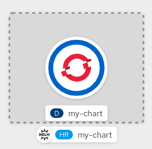

At the end of this chapter you will be able to:
- Create your own `Helm Chart`
- Understand `Helm Templates`
- Understand Helm integrations with `Kubernetes`

After having discovered `helm` CLI to install and manage Helm Charts, we can now create our first one from scratch. Before doing that, let's review the core concepts from [official documentation](https://helm.sh/docs/topics/charts/):

- A `Chart` is a Helm package. It contains all of the resource definitions necessary to run an application, tool, or service inside of a Kubernetes cluster.
- A `Repository` is the place where charts can be collected and shared.
- A `Release` is an instance of a chart running in a Kubernetes cluster- 

Helm uses a packaging format called charts. A chart is a collection of files that describe a related set of Kubernetes resources, and it organized as a collection of files inside of a directory. The directory name is the name of the chart.

## Creating a new Helm Chart

With `helm create` command you can create a chart directory along with the common files and directories used in a chart.

Our code has been already generated with this command:

`helm create my-chart`

Inside `my-chart/` folder you will find these files:

`tree my-chart`{{execute}}

* `Chart.yaml`{{open}}: is a YAML file containing multiple fields describing the chart
* `values.yaml`{{open}}:: is a YAML file containing default values for a chart, those may be overridden by users during helm install or helm upgrade.
* `templates/NOTES.txt`{{open}}: text to be displayed to your users when they run helm install.
* `templates/deployment.yaml`{{open}}: a basic manifest for creating a Kubernetes deployment
* `templates/service.yaml`{{open}}: a basic manifest for creating a service endpoint for your deployment
* `templates/_helpers.tpl`{{open}}: a place to put template helpers that you can re-use throughout the chart

This command generates a skeleton of your Helm Chart, and by default there is an NGINX image as example:

**1. Chart description**

Let's review our `Chart.yaml`{{open}}. This contains `version` of the package and `appVersion` that we are managing, typically this can be refered to a container image tag.

**2. Fill chart with custom values**

In our example, we are working on a Helm Template `templates/deployment.yaml`{{open}} describing a Kubernetes Deployment for our app, containing this structure for `spec.containers.image`:

`image: "{{ .Values.image.repository }}:{{ .Values.image.tag }}"`

> **Note:** *By default `appVersion` from `Chart.yaml` is used as image tag*

In `values.yaml`{{open}} add `image.repository` variable to define the container image for our chart. Click the **Copy to Editor** button below to place this code in `values.yaml`{{open}}:

<pre class="file" data-filename="values.yaml" data-target="insert" data-marker="# TODO: image repository">repository: bitnami/nginx</pre>

Now let's define which tag to use for this container image. Click the **Copy to Editor** button below to place this code in `values.yaml`{{open}}:

<pre class="file" data-filename="values.yaml" data-target="insert" data-marker="# TODO: image tag">tag: latest</pre>

**3. Install**

Install our custom Helm Chart from local folder.

`helm install my-chart ./my-chart`{{execute}}

This will install NGINX like in previous chapter, and we can follow installation like in previous chapter, either from Terminal or OpenShift Console:

`oc get pods`{{execute}}

Review installed revision:

`helm ls`{{execute}}

In next chapter we will add an OpenShift Route as a Helm Template, like for `Service`, to be published in a new revision.
