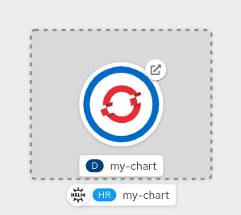
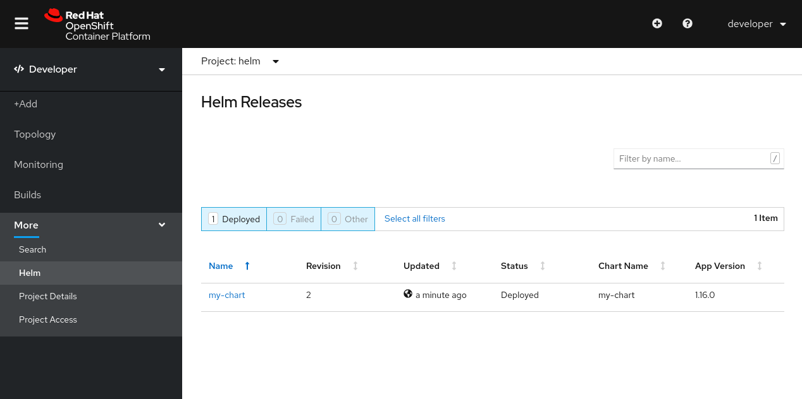

At the end of this chapter you will be able to:
- Manage multiple `Helm Revisions` for your Helm Chart
- `Upgrade` revisions for new changes
- Revert changes with `Rollback` of revisions

## Upgrade revisions

When we install a Helm Chart on OpenShift, we publish a release into the cluster that we can control in terms of upgrades and rollbacks.

To change something in any already published chart, we can use `helm upgrade` command with new parameters or code from our chart.

## Add OpenShift Route as Template

Create a new template for OpenShift Route in `templates` directory, click on `templates/routes.yaml`{{open}} to create one. Click the **Copy to Editor** button below to place this code in `templates/routes.yaml`{{open}}
<pre class="file" data-filename="templates/routes.yaml" data-target="replace">
apiVersion: route.openshift.io/v1
kind: Route
metadata:
  name: {{ include "my-chart.fullname" . }}
  labels:
    {{- include "my-chart.labels" . | nindent 4 }}
spec:
  port:
    targetPort: http
  to:
    kind: Service
    name: {{ include "my-chart.fullname" . }}
    weight: 100
  wildcardPolicy: None
</pre>

Run `helm upgrade` to publish a new revision containing a `my-charm` Route:

`helm upgrade my-chart ./my-chart`{{execute}}

Verify new `Route` from Terminal:

`oc get routes`{{execute}}

Verify new `Revision`:

`helm ls`{{execute}}

Verify new `Route` and new `Revision` from Console:

## Upgrade and Rollback

Let's update again our existing release overriding values in `values.yaml` changing `image.pullPolicy` from chart's default value `IfNotPresent` to `Always`, using same method we adopted previously for changing `service.type` with option `--set`:

`helm upgrade my-chart ./my-chart --set image.pullPolicy=Always`{{execute}}

Let's verify that our changes is reflected into resulting `Deployment`:

`oc get deployment my-chart -o yaml | grep imagePullPolicy`{{execute}}

Get current `Revision`:

`helm ls`{{execute}}

Now that our new release is published and verified, we can decide to rollback to previous version if we need to, and this is possible with `helm rollback` command.

It is also possible to dry-run the rollback with `--dry-run` option:

`helm rollback my-chart 2 --dry-run`{{execute}}

Rollback to starting revision:

`helm rollback my-chart 2`{{execute}}

Check pods:

`oc get pods`{{execute}}

Verify `imagePullPolicy` is rolled back to `Revision` 2 containing `IfNotPresent` Policy:

`oc get deployment my-chart -o yaml | grep imagePullPolicy`{{execute}}

## Uninstall

Uninstall will clean everything now, there's no further need to delete manually the `Route` like in first chapter, since the Helm Chart is now managing that resource:

`helm uninstall my-chart`{{execute}}
