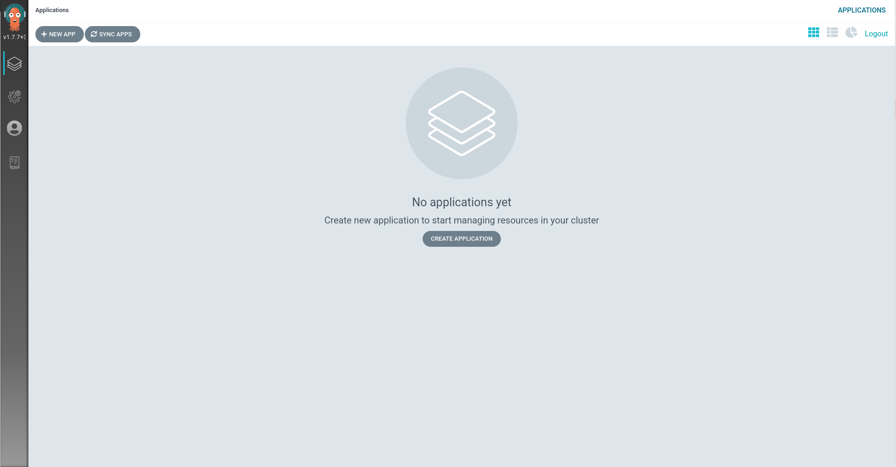

Now that you've verified that Argo CD is up and running, let's explore
how to access and manage Argo CD.

## The Argo CD CLI

Part of the setup of this lab connects you to the Argo CD instance via
CLI. Verify this by running the following:

`argocd cluster list`{{execute}}

You should see output similar to this:

```shell
SERVER                          NAME        VERSION  STATUS   MESSAGE
https://kubernetes.default.svc  in-cluster           Unknown  Cluster has no application and not being monitored.
```

This output lists the clusters that Argo CD manages. In this case
`in-cluster` in the `NAME` field signifies that Argo CD is managing the
cluster it's installed on.

> **NOTE** You can connect multiple clusters for Argo CD to manage!

To enable bash completion, run the following command:

`source <(argocd completion bash)`{{execute}}

The Argo CD CLI stores it's configuration under `~/.argocd/config`

> **NOTE** The `argocd cluster add` command used the `~/.kube/config` file to establish connection to the cluster.

`ls ~/.argocd/config`{{execute}}

The `argocd` CLI tool is useful for debugging and viewing status of your apps deployed.

## The Argo CD Web Console

To get to the Argo CD Web UI; click the [Argo CD Web Console](https://openshift-gitops-server-openshift-gitops.[[HOST_SUBDOMAIN]]-80-[[KATACODA_HOST]].environments.katacoda.com) tab.

Once you have accepted the self signed certificate, you should be
presented with the Argo CD login screen.


You can login with the following
* **Username:** ``admin``{{copy}}
* **Password:** `oc extract secret/openshift-gitops-cluster -n openshift-gitops --to=-`{{execute}}

> **NOTE** The Password is stored in a secret on the platform.

Once you've logged in, you should see the following page.



This is the Argo CD Web UI. Keep this tab open for the next exercise.
