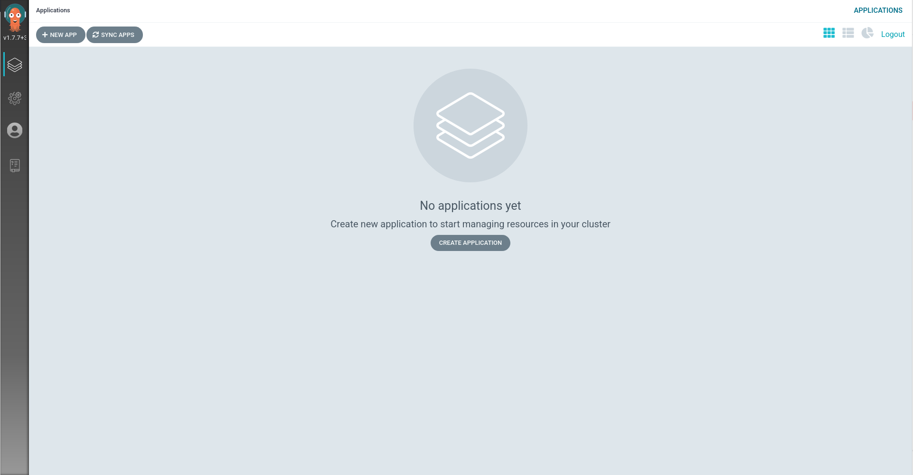

# Setting up ArgoCD

Once the Operator is installed, we need to make some customizations for
this lab. First, we need to patch the manifest so that ArgoCD will ignore
router differences (since every route will be differnet).

`oc patch argocd argocd-cluster -n openshift-gitops --type=json \
-p='[{"op": "add", "path": "/spec/resourceCustomizations", "value":"route.openshift.io/Route:\n  ignoreDifferences: |\n    jsonPointers:\n    - /spec/host\n"}]'`{{execute}}

Next, you need to give the ArgoCD Service account permission to
make changes to your cluster. In practice, you will scope this to a
specific namespace or a set of access. For this lab we will give it
`cluster-admin`.

`oc adm policy add-cluster-role-to-user cluster-admin -z argocd-cluster-argocd-application-controller -n openshift-gitops`{{execute}}

Delete the ArgoCD server pod so that it can relaunch with the new set of permissions.

`oc delete pods -l app.kubernetes.io/name=argocd-cluster-server -n openshift-gitops`{{execute}}

The Operator installs the password in a secret. Extract this password to use to login to the ArgoCD instance.

`oc extract secret/argocd-cluster-cluster -n openshift-gitops --to=-`{{execute}}

To get the route for the ArgoCD UI:

`oc get route argocd-cluster-server -n openshift-gitops -o jsonpath='{.spec.host}{"\n"}'`{{execute}}

Once you visit the URL in your browser, you should be presented with
something that looks like this.

Go ahead and login as `admin` with the password you've extracted above.

You should see this screen:

