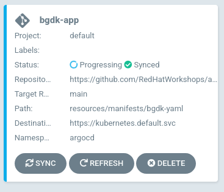
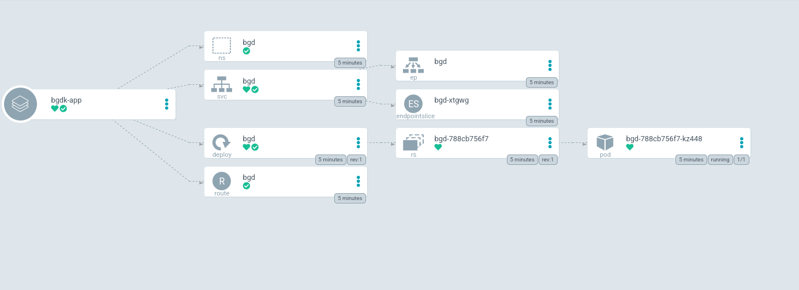
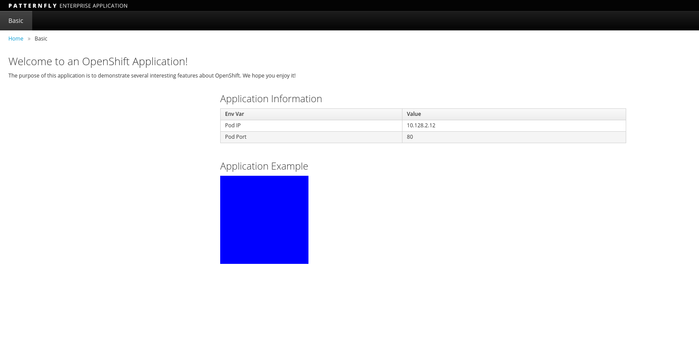
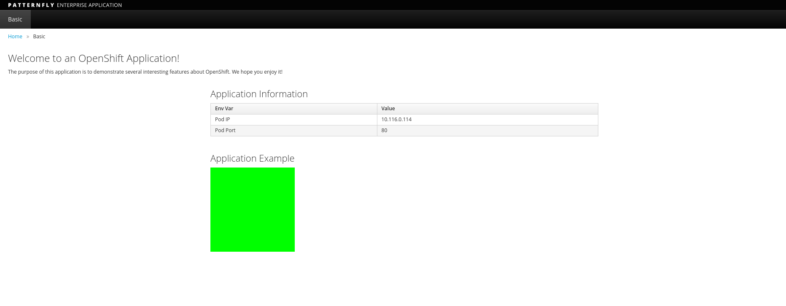
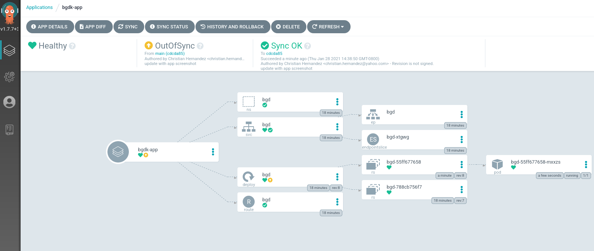
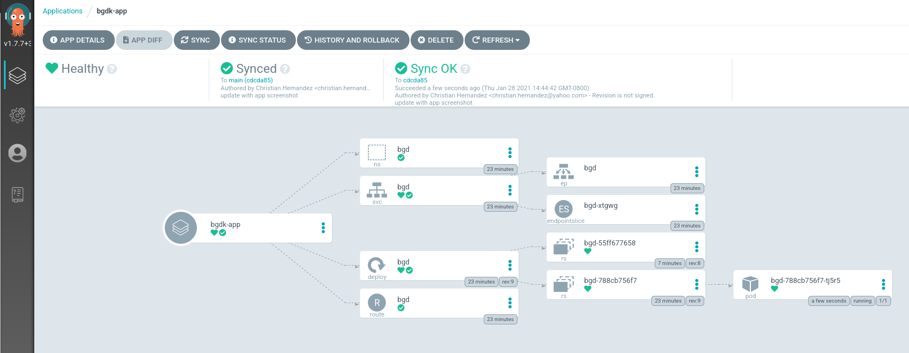

In [this environment](examples/bgdk-yaml), we have
some example manifesets taken from our [sample GitOps
repo](https://github.com/redhat-developer-demos/openshift-gitops-examples).
We'll be uisng this repo to test. These manifests include:

* A **Namespace**: `examples/bgd-yaml/bgd-namespace.yaml`{{open}}
* A **Deployment**: `examples/bgd-yaml/bgd-deployment.yaml`{{open}}
* A **Service**: `examples/bgd-yaml/bgd-svc.yaml`{{open}}
* A **Route**: `examples/bgd-yaml/bgd-route.yaml`{{open}}

Collectively, this is known as an `Application` within ArgoCD. Therefore,
you must define it as such in order to apply these manifest in your
cluster.

Open up the Argo CD `Application` manifest: `bgd-app/bgd-app.yaml`{{open}}

Let's break this down a bit.

* ArgoCD's concept of a `Project` is different than OpenShift's. Here you're installing the application in ArgoCD's `default` project (`.spec.project`). **NOT** OpenShift's `default` project.
* The destination server is the server we installed ArgoCD on (noted as `.spec.destination.server`).
* The manifest repo where the YAML resides and the path to look for the YAML is under `.spec.source`.
* The `.spec.syncPolicy` is set to `false`. Note that you can have Argo CD automatically sync the repo.
* The last section `.spec.sync` just says what are you comparing the repo to. (Basically "Compare the running config to the desired config")

The `Application` CR (`CustomResource`) can be applied by running the following:

`oc apply -f resources/bgd-app/bgd-app.yaml`{{execute}}

This should create the `bgd-app` in the ArgoCD UI.



Clicking on this takes you to the overview page. You may see it as still progressing or full synced. 



> **NOTE**: You may have to click on `show hidden resources` on this page to see it all

At this point the application should be up and running. You can see
all the resources created with the `oc get pods,svc,route -n bgd`{{execute}}
command. The output should look like this:

```shell
NAME                       READY   STATUS    RESTARTS   AGE
pod/bgd-788cb756f7-kz448   1/1     Running   0          10m

NAME          TYPE        CLUSTER-IP       EXTERNAL-IP   PORT(S)    AGE
service/bgd   ClusterIP   172.30.111.118   <none>        8080/TCP   10m

NAME                           HOST/PORT                                PATH   SERVICES   PORT   TERMINATION   WILDCARD
route.route.openshift.io/bgd   bgd-bgd.apps.example.com          bgd        8080                 None
```

Visit your application using the route by clicking [HERE](http://bgd-bgd.[[HOST_SUBDOMAIN]]-80-[[KATACODA_HOST]].environments.katacoda.com)

Your application should look like this.



Let's introduce a change! Patch the live manifest to change the color
of the box from blue to green:

`oc -n bgd patch deploy/bgd --type='json' -p='[{"op": "replace", "path": "/spec/template/spec/containers/0/env/0/value", "value":"green"}]'`{{execute}}

Wait for the rollout to happen:

`oc rollout status deploy/bgd -n bgd`{{execute}}

If you refresh your tab where your application is running you should see a green square now.



Looking over at your Argo CD Web UI, you can see that Argo detects your
application as "Out of Sync".



You can sync your app via the Argo CD by:

* First clicking `SYNC`
* Then clicking `SYNCHRONIZE`

Conversely, you can run `argocd app sync bgd-app`{{execute}}

After the sync process is done, the Argo CD UI should mark the application as in sync.



If you reload the page on the tab where the application is running. It
should have returned to a blue square.


You can setup Argo CD to automatically correct drift in the `Application` manifest; example:

```yaml
spec:
  syncPolicy:
    automated:
      prune: true
```

Or, as a day 2 task, by running the following command: `argocd app set bgd-app --sync-policy automated`{{execute}}