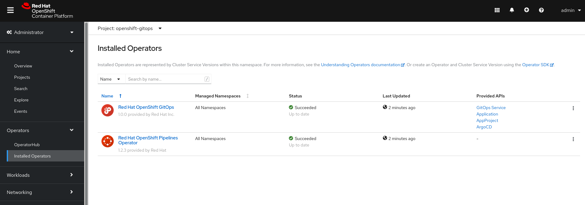

Welcome! In this section we will be exploring the OpenShift GitOps
Operator, what it installs, and how all the components fit together.

## Logging in to the Cluster via Dashboard

Click the [OpenShift Web Console](https://console-openshift-console-[[HOST_SUBDOMAIN]]-443-[[KATACODA_HOST]].environments.katacoda.com) tab to open the OpenShift Web UI. 

You will then be able to login with admin permissions with:

* **Username:** ``admin``{{copy}}
* **Password:** ``admin``{{copy}}

## Exploring the GitOps Operator Installation

The OpenShift GitOps Operator was installed via the Operator Hub. You
can view this installation via the UI in the Administrator Perspective:

* Click on `Operators` drop down on the leftside navigation.
* Click on `Installed Operators`
* In the `Project` dropdown, make sure `openshift gitops` is selected.

You should see that the OpenShift GitOps Operator is installed.



Another way to view what was installed is to run the following:

`oc get operators`{{execute}}

This should have the following output.

```shell
NAME                                                  AGE
openshift-gitops-operator.openshift-operators         25m
openshift-pipelines-operator-rh.openshift-operators   25m
```

This Operator is a "meta" Operator that installs both Argo CD and the
Tekton Operator. This is why you see both the GitOps Operator and the
Tekton Operator listed.

Finally, you can verify the installation by running `oc get pods -n openshift-gitops`{{execute}}

You should something similar to the following output.

```shell
NAME                                                    READY   STATUS    RESTARTS   AGE
argocd-cluster-application-controller-6f548f74b-48bvf   1/1     Running   0          54s
argocd-cluster-redis-6cf68d494d-9qqq4                   1/1     Running   0          54s
argocd-cluster-repo-server-85b9d68f9b-4hj52             1/1     Running   0          54s
argocd-cluster-server-78467b647-8lcv9                   1/1     Running   0          54s
cluster-86f8d97979-lfdhv                                1/1     Running   0          56s
kam-7ff6f58c-2jxkm                                      1/1     Running   0          55s
```

Once you see the all the pods running, you can proceed!