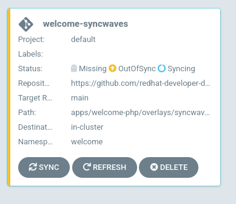
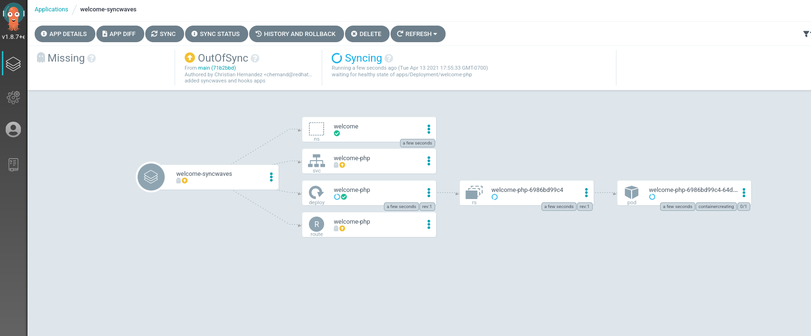

Welcome! In this section we will be exploring how to use syncwaves with
Argo CD.

## Background

A Syncwave is a way to order how Argo CD applies the manifests that are
stored in git. All manifests have a wave of zero by default, but you can
set these by using the `argocd.argoproj.io/sync-wave` annotation. Example:

```yaml
metadata:
  annotations:
    argocd.argoproj.io/sync-wave: "2"
```

The wave can also be negative as well.

```yaml
metadata:
  annotations:
    argocd.argoproj.io/sync-wave: "-5"
```

When Argo CD starts a sync action, the manifest get placed in the following order:

* The Phase that they're in (we'll cover phases in the next section)
* The wave the resource is annotated in (starting from the lowest value to the highest)
* By kind (Namspaces first, then services, then deployments, etc ...)
* By name (ascending order)

Read more about syncwaves on the [official documentation site](https://argoproj.github.io/argo-cd/user-guide/sync-waves/#how-do-i-configure-waves)

## Exploring Manifests

The manifests that will be deployed have been annotated with the following values:

* The Namspace with `0` `openshift-gitops-examples/apps/welcome-php/overlays/syncwaves/welcome-php-ns.yaml`{{open}}
* The Deployment with `1` `openshift-gitops-examples/apps/welcome-php/base/welcome-php-deployment.yaml`{{open}}
* The Service with `2` `openshift-gitops-examples/apps/welcome-php/base/welcome-php-svc.yaml`{{open}}
* Finally the Route with `3` `openshift-gitops-examples/apps/welcome-php/base/welcome-php-route.yaml`{{open}}

Argo CD will apply the Namespace first (since it's the lowest value),
and make sure it returns a "healthy" status before moving on.

Next, the Deployment will be applied. After that reports healthy, Argo
CD will apply the Service then the Route.

> **NOTE** Argo CD won't apply the next manifest until the previous reports "healthy".

## Deploying The Application

Before we deploy this application, make sure you've opened the Argo CD
Web Console.

To get to the Argo CD Web UI; click the [Argo CD Web Console](https://openshift-gitops-server-openshift-gitops.[[HOST_SUBDOMAIN]]-80-[[KATACODA_HOST]].environments.katacoda.com) tab.

Once you have accepted the self signed certificate, you should be
presented with the Argo CD login screen.


You can login with the following
* **Username:** ``admin``{{copy}}
* **Password:** `oc extract secret/openshift-gitops-cluster -n openshift-gitops --to=-`{{execute}}

Apply the Argo CD `Application` manifest to get this application deployed.

`oc apply -f ~/resources/openshift-gitops-examples/components/applications/welcome-syncwaves.yaml`{{execute}}

This should create the `welcome-syncwaves` application.



Clicking on this "card" will take you to the application overview
page. Clicking on "show hidden resources" should expand the "tree"
view.



If you follow along, you'll note that these manfiests get applied in
order of their annotated syncwave!

Keep the Argo CD WebUI tab open for the next exercise.
