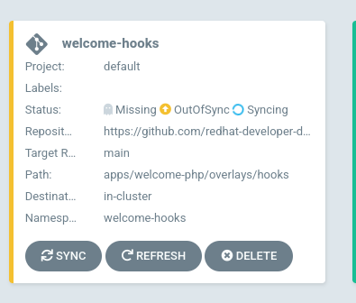
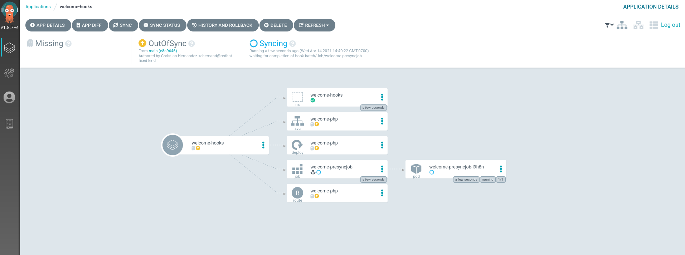

Now that you're familiar with syncwaves, we can begin exploring applying
manifests in phases using `resource hooks`.

## Background

Controlling your sync operation can be futher redefined by using
hooks. These hooks can run before, during, and after a sync
operation. These hooks are:

* **PreSync** - Runs before the sync operation. This can be something like a database backup before a schema change
* **Sync** - Runs after `PreSync` has successfully ran. This will run alongside your normal manifesets.
* **PostSync** - Runs after `Sync` has ran successfully. This can be something like a Slack message or an email notification.
* **SyncFail** - Runs if the `Sync` operation as failed. This is also used to send notifications or do other evasive actions.

To enable a sync, annotate the specific object manfiest with
`argocd.argoproj.io/hook` with the type of sync you want to use for that
resource. For example, if I wanted to use the `PreSync` hook:

```yaml
metadata:
  annotations:
    argocd.argoproj.io/hook: PreSync
```

You can also have the hooks be deleted after a successful/unsuccessful run.

* **HookSucceeded** - The resouce will be deleted after it has succeeded.
* **HookFailed** - The resource will be deleted if it has failed.
* **BeforeHookCreation** - The resource will be deleted before a new one is created (when a new sync is triggered).

You can apply these with the `argocd.argoproj.io/hook-delete-policy`
annotation. For example

```yaml
metadata:
  annotations:
    argocd.argoproj.io/hook: PostSync
    argocd.argoproj.io/hook-delete-policy: HookSucceeded
```

> **NOTE** Since a sync can fail in any phase, you can come to a situation where the application never reports healthy!

Although hooks can be any resource, they are usually Pods and/or Jobs.

To read more about resource hooks, consult the [official documentation](https://argoproj.github.io/argo-cd/user-guide/resource_hooks)

## Exploring Manifests

I will be adding the following manifest to the first
application deployed. Take a look at the manfiest
`openshift-gitops-examples/apps/welcome-php/overlays/hooks/welcome-php-presync-job.yaml`{{open}}

You'll see that I have the annotation `argocd.argoproj.io/hook: PreSync`
set. This means that this Job will run in the `PreSync` phase, before
the application of the manifests in the `Sync` phase.

> **NOTE** Since I don't have a deletion policy, this job will "stick around" after completion.

## Deploying The Application

This sample will be using `kustomize` to create a new application based
on the one we previously deployed; while adding the `Job`
with the resource hook. You can see this by [visiting the repo](https://github.com/redhat-developer-demos/openshift-gitops-examples/tree/main/apps/welcome-php/overlays/hooks)

Taking a look at the manifest file `openshift-gitops-examples/components/applications/welcome-hooks.yaml`{{open}}
will show that this will deploy the application in the `welcome-hooks`
namespace.

Create this application `oc apply -f ~/resources/openshift-gitops-examples/components/applications/welcome-hooks.yaml`{{execute}}

On the Argo CD WebUI, you should see another application appear.



Clicking on this "card" should take you over to the tree view.



Observe the sync process. You will see that the `PreSync` manifest has
an anchor icon ⚓ . You will also notice that the other manifests don't
start applying until the `PreSync` Job is done.

Once the application is fully synced. Take a look at the pods and jobs in
the namespace: `oc get pods,jobs -n welcome-hooks`{{execute}}

You should see that the Job is finished, but still there.

```shell
NAME                               READY   STATUS      RESTARTS   AGE
pod/welcome-php-6986bd99c4-7w7qk   1/1     Running     0          2m43s
pod/welcome-presyncjob-l9h8n       0/1     Completed   0          3m14s

NAME                           COMPLETIONS   DURATION   AGE
job.batch/welcome-presyncjob   1/1           30s        3m14s
```

Keep this tab open, in the next exercise. We will see how to use Syncwaves
and Hooks in tandem!