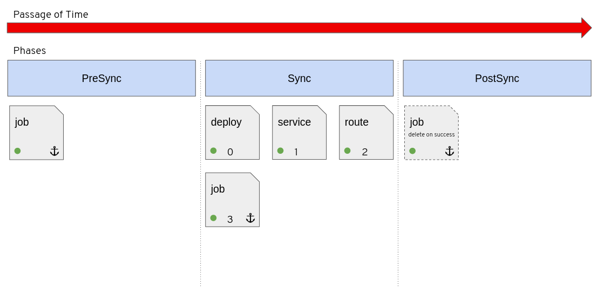
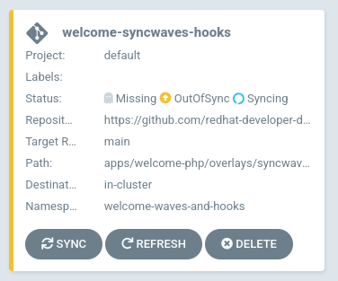
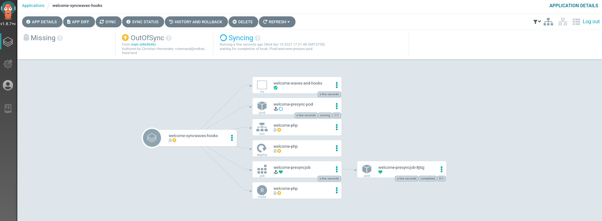

Now that you got your hands on syncwaves and resource hooks, you will
now use them together to see how you can control how your deployment
rolls out.

## Background

In the previous sections you learned how to order the application
of manifests using syncwaves. You also went over how you phase your
deployments with resource hooks.

In this section we will use syncwaves within each phase to show how you
can further refine the deployment process.

Take a look at the following diagram.



The workflow can be summarized like this:

* The `PreSync` phase will run and manifests will be applied in their syncwave order.
* Once the `PreSync` phase is successful, the `Sync` phase begins.
* The `Sync` phase will apply the manifests in the their syncwave order
* Finally, after the `Sync` phase is done, the `PostSync` phase applies the manifests in the syncwave order.

## Exploring Manifests

Using Kustomize, we will be adding 3 addition manifests.

* A `PreSync` Job with a syncwave of 0 `openshift-gitops-examples/apps/welcome-php/overlays/syncwaves-and-hooks/welcome-php-presync-job.yaml`{{open}}
* A `PreSync` Pod with a syncwave of 1 and a hook deletion policy `openshift-gitops-examples/apps/welcome-php/overlays/syncwaves-and-hooks/welcome-php-presync-pod.yaml`{{open}}
* A `PostSync` Pod with a hook deletion policy `openshift-gitops-examples/apps/welcome-php/overlays/syncwaves-and-hooks/welcome-php-postsync-pod.yaml`{{open}}

The manifest will apply in the following order.

* `PreSync` - The Job will start and finish. The the Pod will start and finish. Once these are both done successfully the `PreSync` phase is considered "done".
* `Sync` - All the manifests will apply in their respective syncwave order. Once this is done successfully, the `Sync` phase is considered done.
* `PostSync` - The Pod will start and finish. Once it's successfully finished, the resource is deleted.


## Deploying the Application

Take a look at the manifest file `openshift-gitops-examples/components/applications/welcome-syncwaves-and-hooks.yaml`{{open}}

As before, we are using Kustomize to deploy the same application,
but in a different namespace and we are loading in the 3 additional
manifests. You can see the specific implementation in the [git repo](https://github.com/redhat-developer-demos/openshift-gitops-examples/tree/main/apps/welcome-php/overlays/syncwaves-and-hooks)

Create this application `oc apply -f ~/resources/openshift-gitops-examples/components/applications/welcome-syncwaves-and-hooks.yaml`{{execute}}

This should create the 3rd application on Argo CD.



Clicking on this card should take you to the tree view.



Here you can observe the sync process happening in the order
specified. You will also note that the `PreSync` Pod and the `PostSync`
pod were deleted after the sync process because of the deletion policy
annotation.

Take a look to verify: `oc get pods,jobs -n welcome-waves-and-hooks`{{execute}}

You should see the following output.

```shell
NAME                               READY   STATUS      RESTARTS   AGE
pod/welcome-php-6986bd99c4-vv499   1/1     Running     0          4m52s
pod/welcome-presyncjob-8jtqj       0/1     Completed   0          5m24s

NAME                           COMPLETIONS   DURATION   AGE
job.batch/welcome-presyncjob   1/1           18s        5m24s
```
