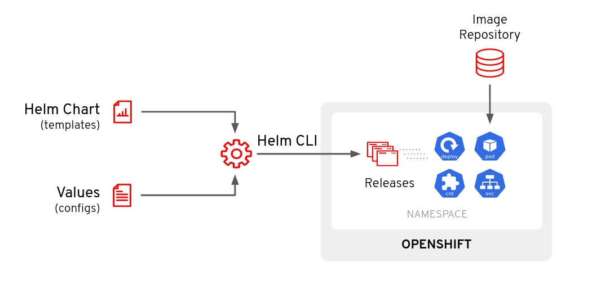
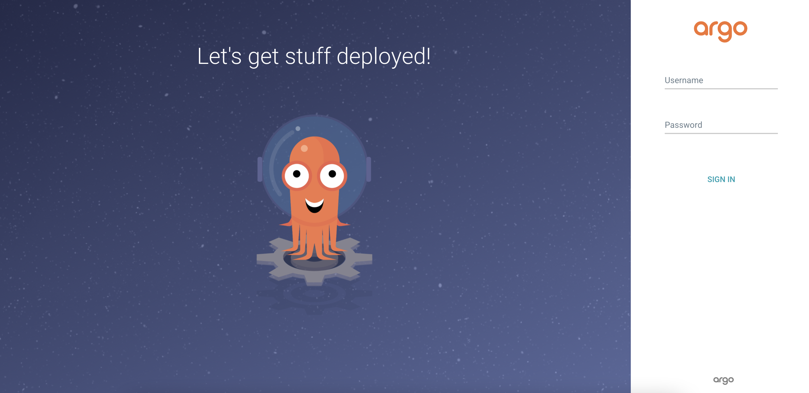
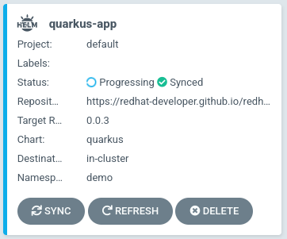
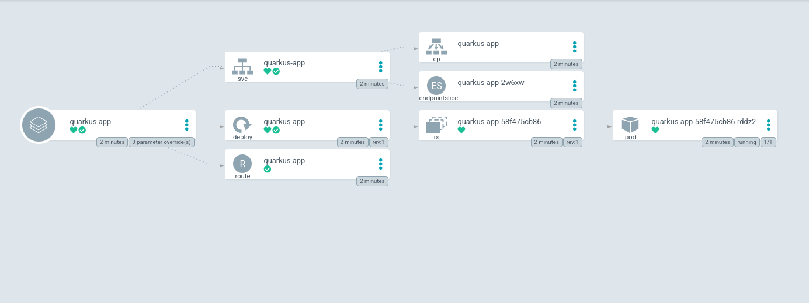
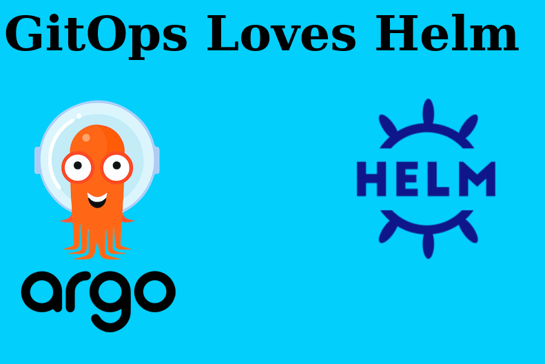
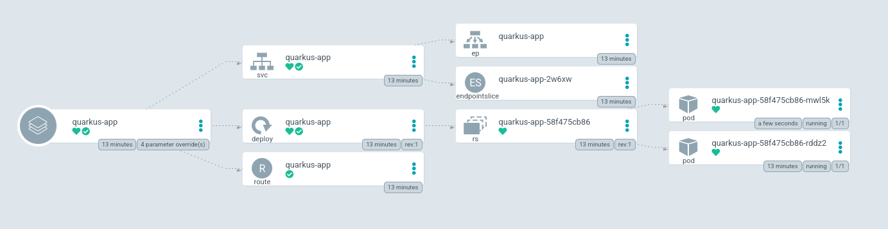

Welcome! In this section we will be exploring the native Helm integration
within Argo CD.

## Background

Helm has become the defacto way of packaging up and deploying application
stacks on Kubernetes. You can think of Helm as sort of a package manager
for Kubernetes. The main components of Helm are:

* `Chart` a package consisting of related Kubernetes YAML files used to deploy something (Application/Application Stack/etc).
* `Repository` a place where Charts can be stored, shared and distributed.
* `Release` a specific instance of a Chart deployed on a Kubernetes cluster.

Helm works by the user providing parameters (most of the time via a YAML
file) against a Helm chart via the CLI. These parameters get injected
into the Helm template YAML to produce a consumable YAML that us deployed
to the Kubernetes cluster.



Argo CD has native support for Helm built in. You can directly
call a Helm chart repo and provide the values directly in the
[Application](https://argoproj.github.io/argo-cd/operator-manual/declarative-setup/#applications)
manifest. Furthermore, you can interact and manage the Helm release on
your cluster directly with Argo CD via the UI or the CLI.

In this scenario, we will explore how to deploy a Helm chart using the
native integration in Argo CD.

## Exploring Manifests

You can specify your Helm repo, chart, and values directly in the
`Application` manfiest for Argo CD. Let's take a look at the example
we're going to deploy. `openshift-gitops-examples/components/applications/quarkus-app.yaml`{{open}}

This `Application` deploys a sample Quarkus application. If you take
a look at the file, you can see the specific configuration under
`.spec.source.helm`. Let's take a look at this section/snippet of
the YAML:

```yaml
spec:
  source:
    helm:
      parameters:
        - name: build.enabled
          value: "false"
        - name: deploy.route.tls.enabled
          value: "true"
        - name: image.name
          value: quay.io/ablock/gitops-helm-quarkus
    chart: quarkus
    repoURL: https://redhat-developer.github.io/redhat-helm-charts
    targetRevision: 0.0.3
```

Let's break this `.spec.source.helm` section down a bit:

* `parameters` - This section is where you'll enter the parameters you want to pass to the Helm chart. These are the same values that you'd have in your `Values.yaml` file.
* `chart` - This is the name of the chart you want to deploy from the Helm Repository.
* `repoURL` - This is the URL of the Helm Repository.
* `targetRevision` - This is the version of the chart you want to deploy.

This can be used to deploy the Helm chart on to your cluster, which is like using `helm install ...`.

> **NOTE** What actually happens is that Argo CD
> runs a `helm template ... | kubectl apply -f -`. We'll go over that
> a little later


## Deploying The Application

Before we deploy this application, make sure you've opened the Argo CD
Web Console.

To get to the Argo CD Web UI; click the [Argo CD Web Console](https://openshift-gitops-server-openshift-gitops.[[HOST_SUBDOMAIN]]-80-[[KATACODA_HOST]].environments.katacoda.com) tab.

Once you have accepted the self signed certificate, you should be
presented with the Argo CD login screen.



You can login with the following
* **Username:** ``admin``{{copy}}
* **Password:** `oc extract secret/openshift-gitops-cluster -n openshift-gitops --to=-`{{execute}}

Apply the Argo CD `Application` manifest to get this Helm chart deployed.

`oc apply -f ~/resources/openshift-gitops-examples/components/applications/quarkus-app.yaml`{{execute}}

This should create the `quarkus-app` application. Note the Helm icon
⎈ denoting it's a Helm application.



Clicking on this "card" will take you to the application overview
page. Clicking on "show hidden resources" should expand the "tree"
view.



Grab the URL by running the following command: `oc get route/quarkus-app -n demo  -o jsonpath='{.spec.host}{"\n"}'`{{execute}}

If you visit [that URL](https://quarkus-app-demo.[[HOST_SUBDOMAIN]]-80-[[KATACODA_HOST]].environments.katacoda.com), you should see the following page.
          



You can now interact with this `Application` using the `argocd` CLI. For instance; if I want to change the scale of my application to 2 replicas, I just modify that value using the `argocd` CLI.

First, check to see how many pods you have running: `oc get pods -n demo`{{execute}}

The output should look like this.

```shell
NAME                           READY   STATUS              RESTARTS   AGE
quarkus-app-58f475cb86-rddz2   1/1     Running             0          14m
```

Now, modfy the Helm values: `argocd app set quarkus-app -p deploy.replicas=2`{{execute}}

You should now have 2 pods for this `Application`: `oc get pods -n demo`{{execute}}

There will now be two pods.

```shell
NAME                           READY   STATUS              RESTARTS   AGE
quarkus-app-58f475cb86-rddz2   1/1     Running             0          15m
quarkus-app-58f475cb86-s9llq   0/1     ContainerCreating   0          1s
```

The Argo CD UI should show the application with 2 pods and fully healthy/in sync.



This is a valid, and completely supported way of deploying your Helm
charts using Argo CD. But this isn't GitOps friendly. Lets see how we
can use Helm in a GitOps workflow.

Keep the Argo CD WebUI tab open for the next exercise, where we'll
explore a more GitOps friendly way of deploying Helm charts.