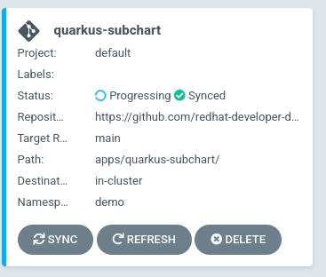
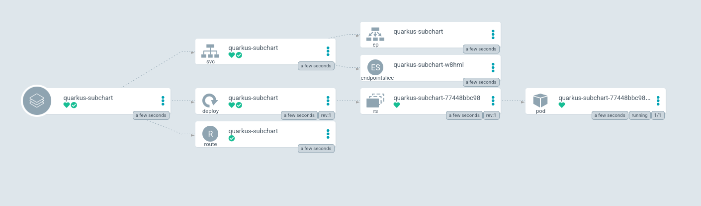

In this section, we will be exporting GitOps deployment patterns with
Helm!

## Background

In the previous section, you saw how you can deploy a Helm chart
natively with Argo CD. This method had you providing the Helm Repo,
Chart, and Values directly in the config. Before, it was mentioned that, although
valid, it's not GitOps friendly.

In a GitOps workflow, the state of your application deployment must be
stored in a SCM repo (like GitHub). In order to do this you must save the
`values.yaml` in a git repo and reference the Helm repo somehow.

This is where the [Helm Subchart/Dependency](https://github.com/argoproj/argocd-example-apps/blob/master/helm-dependency/README.md)
deployment strategy comes in.

## Exploring Manifests

We will be using the [examples repo](https://github.com/redhat-developer-demos/openshift-gitops-examples) for this and we will be targeting the [quarkus-subchart](https://github.com/redhat-developer-demos/openshift-gitops-examples/tree/main/apps/quarkus-subchart) directory. This has already been cloned into your environment you can take a look at it by running:

`tree ~/resources/openshift-gitops-examples/apps/quarkus-subchart`{{execute}}

This should have the following output.

```shell
openshift-gitops-examples/apps/quarkus-subchart
├── Chart.yaml
└── values.yaml

0 directories, 2 files
```

As you can see, this is made up of only two YAML files. The `Chart.yaml` file and the `values.yaml` file. Take a look at the chart file:

`openshift-gitops-examples/apps/quarkus-subchart/Chart.yaml`{{open}}

This `Chart.yaml` file, is creating an "empty" Helm chart and adding the Helm chart you want to deploy as a dependency in the `dependecies` secion.

> **NOTE** You can deploy more than one Helm chart using this method.

The next file is the `values.yaml` file. Take a look at that file.

`openshift-gitops-examples/apps/quarkus-subchart/values.yaml`{{open}}

Here you're specifying the values you want to pass to the Helm chart.

This is more GitOps friendly as now the state of your deployment is
stored in a git repo. You can now use git workflows to update this
application if, for example, you want to change the image or the number of
replicas. You can now PR into this repo as you would in a GitOps workflow.

The Argo CD `Application` should look like a "normal" `git` application.

`openshift-gitops-examples/components/applications/quarkus-subchart.yaml`{{open}}

In this snippet, you can see that now we're targeting the git repo instead of the Helm repo.

```yaml
  source:
    path: apps/quarkus-subchart/
    repoURL: https://github.com/redhat-developer-demos/openshift-gitops-examples
    targetRevision: main
```

Let's deploy this application!

## Deploying The Application

Before we deploy this application, make sure you've opened the Argo CD
Web Console.

Like in the previous Step, open the Argo CD Web UI by clicking the [Argo CD Web Console](https://openshift-gitops-server-openshift-gitops.[[HOST_SUBDOMAIN]]-80-[[KATACODA_HOST]].environments.katacoda.com) tab.

Apply the Argo CD `Application` manifest to get this Helm chart deployed.

`oc apply -f ~/resources/openshift-gitops-examples/components/applications/quarkus-subchart.yaml`{{execute}}

This should create the application.

> **NOTE** The Helm logo ⎈ does not appear. It's now a git logo since we're now just loading YAML



Clicking on this "card" will take you to the application overview
page. Click on "show hidden resources" if you need to, to expand the
"tree" view.



That's it! You've now deployed a Helm chart in a GitOps friendly way
using Argo CD!

There is one important thing to note. We've deployed this Helm chart
twice, and you can see this using the argocd CLI:

`argocd app list -o name`{{execute}}

This should have the following output:

```shell
quarkus-app
quarkus-subchart
```

You can also see this on the cluster itself:

`oc get applications -n openshift-gitops`{{execute}}

This should have an output similar to this.

```shell
NAME               SYNC STATUS   HEALTH STATUS
quarkus-app        Synced        Healthy
quarkus-subchart   Synced        Healthy
```

However, when you try and list the applications using the Helm CLI; you don't see it.

`helm ls --all-namespaces`{{execute}}

This should show no Helm releases.

```shell
NAME    NAMESPACE       REVISION        UPDATED STATUS  CHART   APP VERSION

```

This is because of how Argo CD deploys the Helm charts. When Argo CD
deploys a Helm chart, it deploys it by running `helm template` and
piping that into `kubectl apply -f`. Which means that Argo CD converts
Helm templates (with the values provided) into "raw", Kubernetes YAML.
