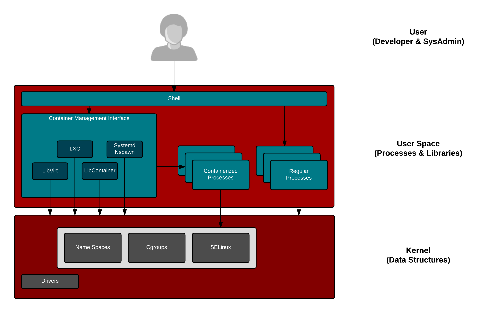

Learning container internals is really about applying what you already know about Unix/Linux Internals. With just a bit of training to expand the way you think about containers, it's possible to apply a lot of your existing knowledge when building and running containerized applications and the clusters in which they will run. To bridge the gap, we need to understand some fundamental primitives including: libraries, containerized processes, regular processes, kernel data structures (namespaces, cgroups, SELinux). Containers started in the Linux kernel and remain there today. What;s gotten easier over time, is how your start and manage them - libraries like LXC, libcontainer, LXD, Docker and Kubernetes made it easier and easier to start containers on a Linux system.

Since most of you have probably have experience with Docker, we will start with that - later we will move on to Kubernetes. The docker command makes it really easy to start a couple of containers and even show which ones are running, but it actually relies on a lot of system libraries to communicate with the kernel. Libraries like libcontainer, libseccomp, libselinux, libpcap and libc all assist in interacting with the kernel. Storage, network, process, and security data structures are all manipulated when a container is started or stopped.

``ldd /usr/bin/docker-current``{{execute}}

Let's move on...
