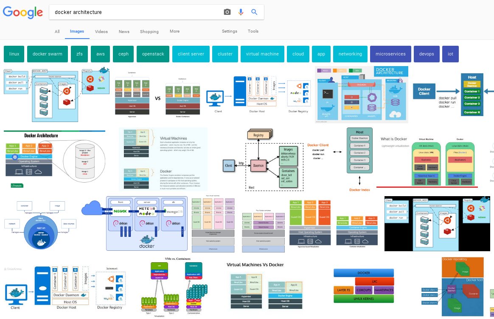

First and foremost, you need to understand that THE INTERNET IS WRONG. If you just do a quick Google search, you will find architecture drawing after architecture drawing showing things the wrong way or with only part of the solution.

What’s wrong? Two main things:
 
1. Most of the architectural drawings above show the docker daemon as a wide blue box stretched out over the container host. The containers are shown as if they are running on top of the docker daemon. This is incorrect - the containers are actually created and run by the Linux kernel.
2. When the architectural drawings do actually show the right architecture between the docker daemon, libcontainer/lxc/etc and the kernel, they never show containers running side by side. This leaves the viewer to imagine #1.
 
OK, let’s start from scratch. In the terminal, let's start with a simple experiment - start the top command in a container:

``docker run -td rhel7 top``{{execute}}''

Now, let's inspect the process table of the underlying host:

``ps -ef | grep top``{{execute}}

Even though we started the top command in a docker contianers, notice that it's just a regular process which can be viewed with the trusty old ps command. That's because containers are just fancy Linux processes with extra isolation. Containerized processes are isolated using selinux and cgroups - they are also started in a special way, but they are still just Linux processes. Containerized processes and regular Linux processes, long lived daemons, batch jobs, and interactive commands all live side by side, making requests to the Linux kernel for protected resources like memory, ram, tcp sockets, etc. We will explore this deeper in later labs, but for now, let's move on...
