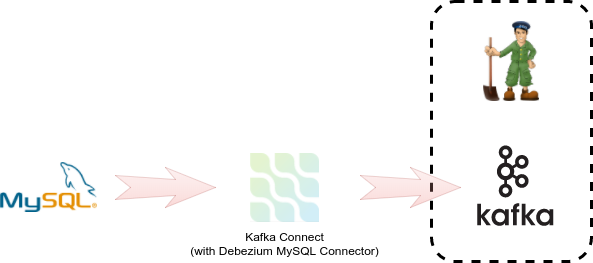

A fresh project named `debezium` for user `debezium` with password `debezium` is prepared with necessary resources required to execute deployment.
There are multiple resource created for you in the project itself or configured in OpenShift
* MySQL instance containing a small set of data to be streamed
* templates used to deploy components
* persistent volumes for stateful components

**1. Run the following commands to switch to `debezium` project and explore it.**
> If you click on command it gets automatically copied it into the terminal and is executed

Switch to `debezium` project

``oc project debezium``{{execute}}

Check that MySQL instance is running

``oc get pods``{{execute}}

and that is exposed as a service

``oc get svc``{{execute}}

The diagram of deployment now looks like

**2. Deploy Kafka broker with ZooKeeper.**

The first component to deploy is a Kafka broker.

This task is delegated to [templates](https://github.com/EnMasseProject/barnabas/tree/master/kafka-statefulsets/resources) provided by [Barnabas](https://github.com/EnMasseProject/barnabas/) project.
The templates are already installed in the `openshift` namespace.

The templates by default deploys Kafka broker and ZooKeeper in a high-available configuration with replication factor `3`.
This is not necessary in development environment so we reduce the number of nodes and replication factor for system topics to `1`.

To deploy the broker issue a command

``oc new-app barnabas -p ZOOKEEPER_NODE_COUNT=1 -p KAFKA_NODE_COUNT=1 -p KAFKA_OFFSETS_TOPIC_REPLICATION_FACTOR=1 -p KAFKA_TRANSACTION_STATE_LOG_REPLICATION_FACTOR=1
``{{execute}}

Now let's wait till both ZooKeeper and Kafka broker are deployed

``oc get pods -w``{{execute}}

The final list of pods should be similar to

    NAME                    READY     STATUS      RESTARTS   AGE
    kafka-0                 1/1       Running     2          3m
    zookeeper-0             1/1       Running     0          3m
    mysql-1-1f1bd           1/1       Running     0          6m

> Note: Kafka depends on ZooKeeper so intermittent Kafka failures are expected as ZooKeeper might not be initialized at time of Kafka start.

New services are available

``oc get svc -l app=barnabas``{{execute}}

    NAME                 CLUSTER-IP       EXTERNAL-IP   PORT(S)                      AGE
    kafka                172.30.180.219   <none>        9092/TCP                     5m
    kafka-headless       None             <none>        9092/TCP                     5m
    zookeeper            172.30.220.246   <none>        2181/TCP                     5m
    zookeeper-headless   None             <none>        2181/TCP,2888/TCP,3888/TCP   5m

**3. Verify the the broker is up and running.**

Try to send a message to

``echo "Hello world" | oc exec -i kafka-0 -- /opt/kafka/bin/kafka-console-producer.sh --broker-list localhost:9092 --topic test``{{execute}}

and receive a message from

``oc exec kafka-0 -- /opt/kafka/bin/kafka-console-consumer.sh --bootstrap-server localhost:9092 --topic test --from-beginning --max-messages 1``{{execute}}

the deployed broker is available.

## Congratulations

You have now successfully executed the first step in this scenario. 

You have successfully deployed Kafka broker service and made it available to clients to produce and consume messages.

In next step of this scenario we will deploy a single instance of Debezium.
