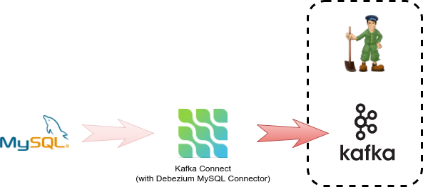

We are going to use [binary build](https://docs.openshift.org/latest/dev_guide/dev_tutorials/binary_builds.html) feature of OpenShift together with [distribution](http://central.maven.org/maven2/io/debezium/debezium-connector-mysql/0.6.2/) of MySQL [plugin](http://debezium.io/docs/connectors/mysql/) to deploy a Kafka Connect node with Debezium MySQL plugin embedded.

**1. Deploy an empty Kafka Connect node**

We will again use a [template](https://github.com/EnMasseProject/barnabas/tree/master/kafka-connect/s2i/resources) from Barnabas project that is alread installed in the environment.
As with Kafka broker we need to configure the template to support single-instance-only deployment.

``oc new-app barnabas-connect-s2i -p BUILD_NAME=debezium -p TARGET_IMAGE_NAME=debezium -p TARGET_IMAGE_TAG=0.6 -p KAFKA_CONNECT_CONFIG_STORAGE_REPLICATION_FACTOR=1 -p KAFKA_CONNECT_OFFSET_STORAGE_REPLICATION_FACTOR=1 -p KAFKA_CONNECT_STATUS_STORAGE_REPLICATION_FACTOR=1``{{execute}}

A new build config will be created

``oc get bc``{{execute}}

    NAME       TYPE      FROM      LATEST
    debezium   Source    Binary    1

new service is deployed

``oc get svc -l app=barnabas-connect-s2i``{{execute}}

    NAME            CLUSTER-IP     EXTERNAL-IP   PORT(S)    AGE
    kafka-connect   172.30.29.20   <none>        8083/TCP   12m

and a new Connect node without any additional plugin is deployed.

``oc get pods -l app=barnabas-connect-s2i``{{execute}}

    NAME                    READY     STATUS    RESTARTS   AGE
    kafka-connect-2-33tlq   1/1       Running   0          4m

**2. Embed Debezium into Connect**
We will use a binary build to create a Connect node with Debezium plugin inside

``oc start-build debezium --from-archive http://central.maven.org/maven2/io/debezium/debezium-connector-mysql/0.6.2/debezium-connector-mysql-0.6.2-plugin.tar.gz --follow``{{execute}}

The Connect node should be redeployed after build completes

``oc get pods -l app=barnabas-connect-s2i``{{execute}}

    NAME                    READY     STATUS        RESTARTS   AGE
    kafka-connect-1-rhr92   1/1       Terminating   0          1m
    kafka-connect-2-p39mx   1/1       Terminating   0          32s
    kafka-connect-3-pv5pf   1/1       Running       0          12s

**3. Verify that Connect is up and contains Debezium**

``oc exec kafka-0 -- curl -s http://kafka-connect:8083/connector-plugins``{{execute}}

    [
        {"class":"io.debezium.connector.mysql.MySqlConnector","type":"source","version":"0.6.2"},
        {"class":"org.apache.kafka.connect.file.FileStreamSinkConnector","type":"sink","version":"1.0.0"},
        {"class":"org.apache.kafka.connect.file.FileStreamSourceConnector","type":"source","version":"1.0.0"}
    ]

The Connect node has a `MySqlConnector` connector plugin available.

## Congratulations

You have now successfully executed the second step in this scenario. 

You have successfully deployed Kafka node and configured it to contain Debezium.

In next step of this scenario we will finish deployment by creating a connection between database source and Kafka Connect.
