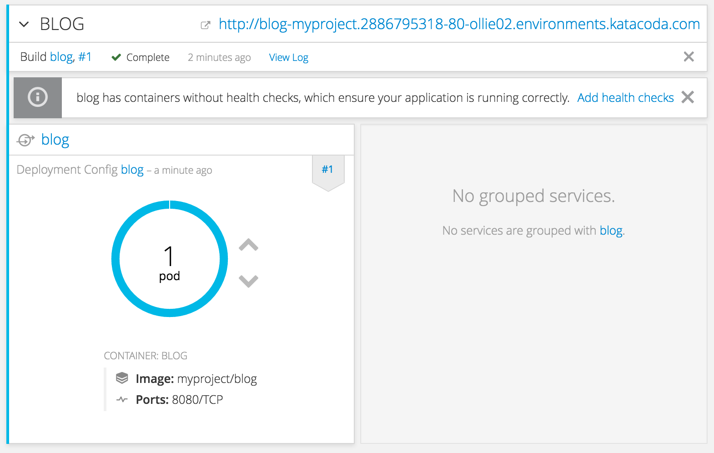

Once the build of the application image has completed, it will be deployed. The _Overview_ page will indicate this via the banner for the build indicating the build is complete. The _Deployment Config_ pane will also show the state of the deployment and indicate the number of running pods.

