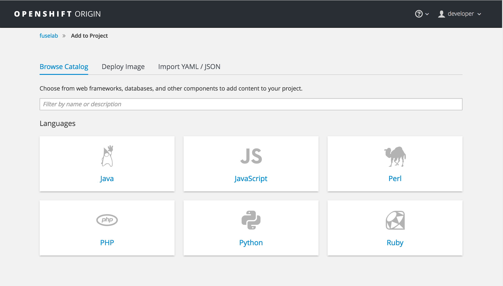
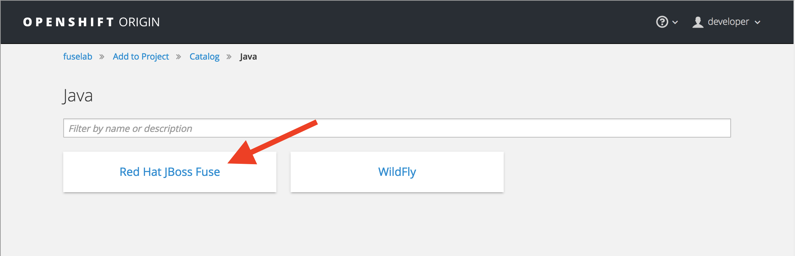
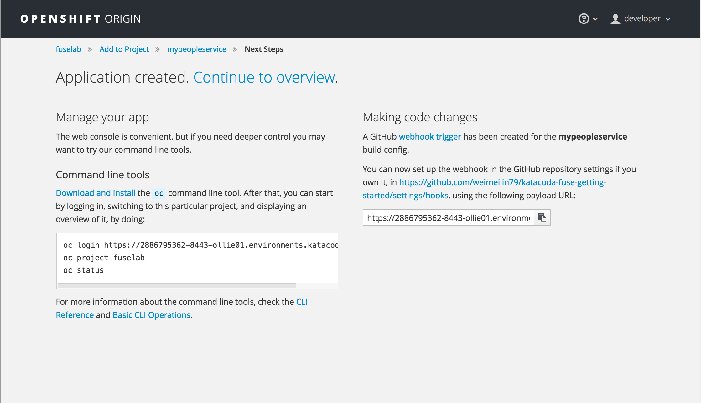

When you are in an empty project, a prominent _Add to Project_ button will be displayed in the centre of the page.

If applications had previously been deployed to the project, or you were not on the project _Overview_ page, you can use the _Add to project_ link in the menu bar.

Clicking on either option, you should be presented with the catalog browser.

In this course you are going to deploy a API service implemented using **Red Hat Fuse**.

Select the _Java_ category from the catalog browser. Any options for deploying applications which are related to Java will be displayed. 

In the environment used for this course, the only option presented will be that for the Python Source-to-Image (S2I) builder.

For this exercise select the _fis-java-openshift_ from the list and leave the version as ``2.0``.

Click on _Select_ to bring up the deployment options for the Python S2I builder.

For the _Name_ to be given to resources, enter:

`mypeopleservice`{{copy}}

For the _Git Repository URL_ enter:

`https://github.com/weimeilin79/katacoda-fuse-getting-started.git`{{copy}}

When you are ready, at the bottom of the page click on _Create_. This will take you to a splash page confirming the application has been created.

Click on _Continue to overview_ and you will be returned to the _Overview_ page, where you can view the details of the application created and monitor progress as it is built and deployed.

