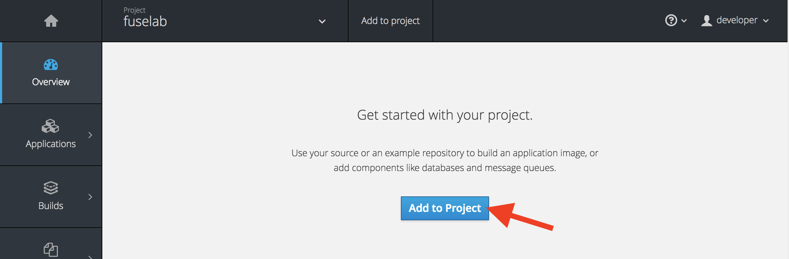

Inside the project, where is this case it should be an empty project, a prominent _Add to Project_ button will be displayed in the centre of the page.



Its now time have OpenShift build and deploy our newly developed API. In our case we have a predefined OpenShift Template, which contains the details for our services, build configurations, and deployment configurations. The template also references the source repositories which contain the Fuse API application.

Lets head on back over to the terminal.  The first step in building and deploying our API is to add the template to OpenShift by executing the following command :

`oc create -f fgstemplate.yml`{{execute}}

If successful, you will be prompted with the following output:

```template "mypeopleservice-template" created```


Once the template is available in OpenShift we can now create the actual API service by running: 

`oc new-app mypeopleservice-template`{{execute}}

Once complete, you should see something similar to the output below: 

```
--> Deploying template "fuselab/mypeopleservice-template" to project fuselab

     mypeopleservice-template
     ---------
     Katacode || FUSE || Getting started


     * With parameters:
        * Application Name=mypeopleservice
        * Git Repository URL=https://github.com/weimeilin79/katacoda-fuse-getting-started.git
        * CONTEXT_DIR=
        * Git Reference=master
        * Builder version=2.0
        * Application Version=1.0.0
        * Maven Arguments=package -DskipTests -Dfabric8.skip -e -B
        * Extra Maven Arguments=
        * Maven build directory=
        * Image Stream Namespace=openshift
        * Git Build Secret=6n3kxwUfa8Y37EMQNwH7c3e6S7VDXrLq2DvSMjeX # generated

--> Creating resources ...
    service "mypeopleservice" created
    imagestream "mypeopleservice" created
    buildconfig "mypeopleservice" created
    deploymentconfig "mypeopleservice" created
--> Success
    Use 'oc start-build mypeopleservice' to start a build.
    Run 'oc status' to view your app.
```

The ``oc start-build`` command tells OpenShift to start the build process which starts downloads, compiles, and utlimately packages your code deployment on OpenShift. Kick start and build application by running : 

`oc start-build mypeopleservice`{{execute}}

Once complete you should see output similar to: 

```build "mypeopleservice-1" started```


Go back to the console and reload/refresh the page. Returned to the _Overview_ page, where you can view the details of the application created and monitor progress as it is built and deployed.


