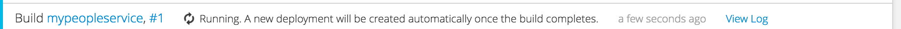
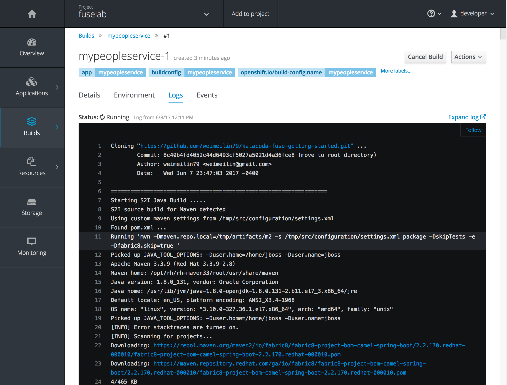
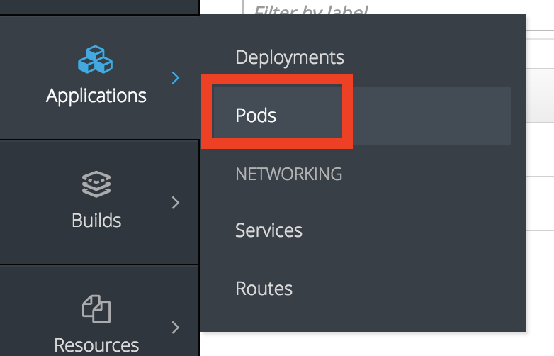
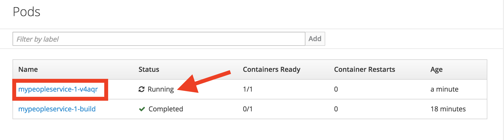

While a build is running, the _Overview_ page will display a banner. Generally, first time builds will take a couple of minutes the first time through as the build process hydrates the builds local reposiltory with the required build dependencies.

To view the output of the build as it is running, click on _View Log_. This will bring you to the _Logs_ tab of the _Pod_ for the build which is running.

Click on _Follow_ at the right hand side to see the latest log output as it is being produced.

If the banner is not visible, you can access build logs by selecting the _Builds_ menu and then selecting _Builds_.

This will bring up a list of builds which are currently running, as well as builds which have completed. Select on the build number of the last build to bring up the details for the build.

Select on the _Logs_ tab to bring up the log output for the build.

Once the build of the application image has completed, it will be deployed. The _Overview_ page will indicate this by the banner listing the status of the build as complete. The _Deployment Config_ pane will also show the state of the deployment and indicate the number of running pods.

Now that we have successfully built our application, lets take a look at it on the JBoss Fuse Hawtio console.  To get there we start with selecting the Applications menu on the left and then select Pods.

This will bring up a list of available pods for both deployed and running applications and completed builds. Select the pod running current application:

You will be taken directly to the pod detail page. Below the *Template* section on the page you will find a link named "Open Java Console". Go ahead and click it

You are now taken to the JBoss Fuse Hawtio console. MOVE THIS NEXT SENTENCE UP HIGHER IN THE DOCUMENT TO SERVE AS MOTIVATION FOR WHY WE ARE DOING ALL THESE STEPS The JBoss Fuse Hawtio console provides in depth details into our running application including JMX, runtime Threads, and a full selection of tools to drill into the RESTFul API developed and deployed as an Apache Camel route. WHAT IS AN APACHE CAMEL ROUTE? WHAT IS APACHE CAMEL, I THOUGHT WE WERE TALKING ABOUT FIS.

Lets take a look at some statistics provided by the console.  Select the "Route Diagram" to see more detail implementation:

The Route Diagram tab provids a graphical review of all the routes currently deployed in our API application.  After selecting this tab we should see something similar to what is pictured below; 5 routes starting with various EIP depictions of route behavior: WHAT IS EIP?

In the next part of our tutorial we will start calling our newly deployed APIs and reviewing the output on the JBoss Fuse Hawtio console.

