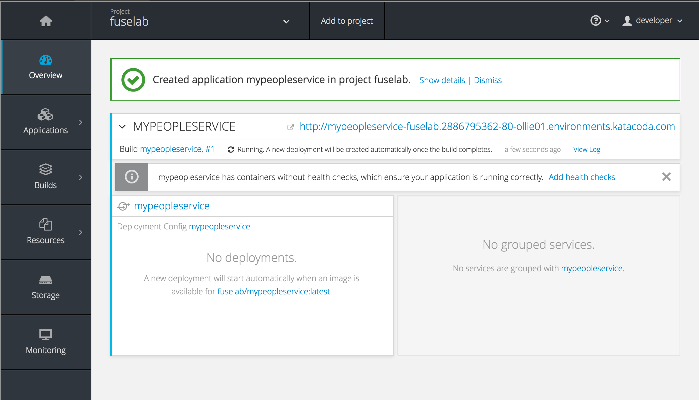
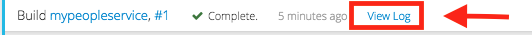
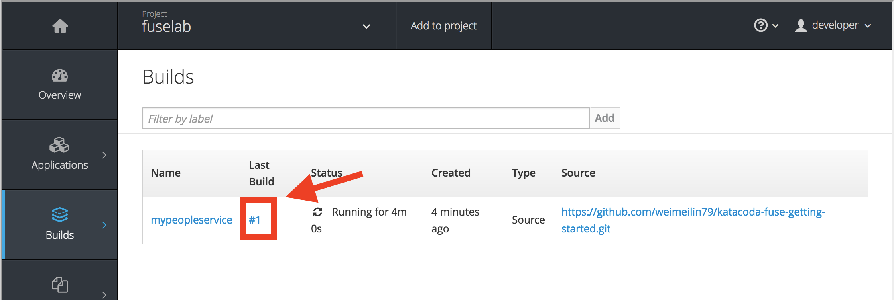
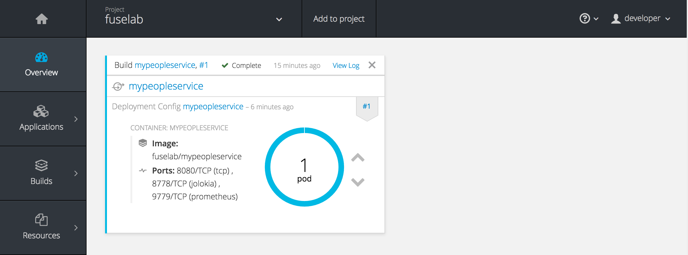

Now that we have kicked off our People Service API build and deployment lets take a look at the logs from our build. First we can take a look at the output from the command line.

Execute the following command:

`oc logs -f bc/mypeopleservice`{{execute}}

We should see the streaming output of our build which will look something like a typical Maven build running through its lifecycle. We can also see this output over in the OpenShift Web Console.

Open the OpenShift Web console by selecting the _Dashboard_ tab at the top of your screen and then click the _Overview_ menu on the left. Here you can view the details of the application created and monitor progress as it is built and deployed. This page will refresh periodically as events in the system, such as your build, begin to occur.

While a build is running, the _Overview_ page will display a banner. To the far right of this banner is a _View Log_ link. Clicking this will take you to the builds logging output screen.

> Note: Generally, first time builds will take an additional few minutes to complete as Maven initializes the applications local repository.

To view the output of the build as it is running, click on _View Log_. This will bring you to the _Logs_ tab of the _Pod_ for the build which is running.

If the banner is not visible, you can access build logs by selecting the _Builds_ menu and then selecting _Builds_.

This will bring up a list of builds which are currently running, as well as builds which have completed. Select on the build number of the last build to bring up the details for the build.

Select on the _Logs_ tab to bring up the log output for the build.

Once the build of the application image has completed, it will be deployed. The _Overview_ page will indicate this by the banner listing the status of the build as complete. The _Deployment Config_ pane will also show the state of the deployment and indicate the number of running pods.

Now that we have successfully built our application, lets take it for a test drive on the JBoss Fuse Hawtio console.  

