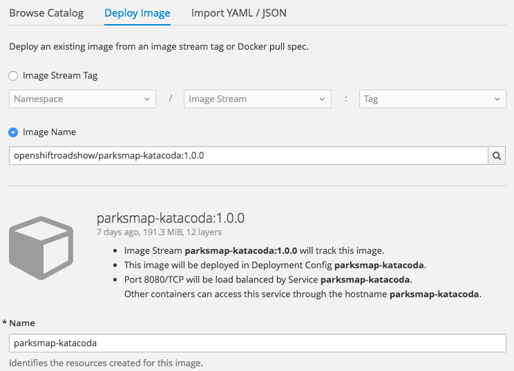
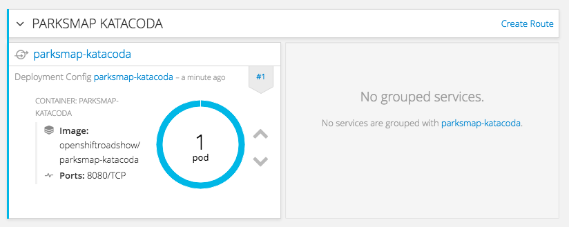

In this lab you are going to deploy the front end web component of the ParksMap application, also called **parksmap**. The web application will display an interactive map, which will be used to display the location of major national parks from all over the world.

# Exercise: Deploying your first Image

The simplest way to deploy an application in OpenShift is to take an existing Docker-formatted image and run it. We are going to use the OpenShift web console to do this, so ensure you have the OpenShift web console open and that you are in the project called ``myproject``.

The OpenShift web console provides various options to deploy an application to a project. For this lab we are going to use the *Deploy Image* method. As the project is empty at this point, the *Overview* page should display a prominent *Add to Project* button.

Selecting the *Add to Project* button you should be presented with the options of *Browse Catalog*, *Deploy Image* and *Import YAML/JSON*. Choose the *Deploy Image* tab.

You could also have selected the *Add to Project* drop down menu in the top menu bar for the project and selected _Deploy Image_ to go direct to the required tab.

Within the *Deploy Image* tab, chose the *Image Name* option. This will be used to reference an existing Docker-formatted image hosted on the Docker Hub Registry. For the name of the image enter:

``openshiftroadshow/parksmap-katacoda:1.0.0``{{copy}}

and press enter, or click on the magnifying glass icon to the right of the text entry box.

At this point OpenShift will pull down and display key information about the image and the pending deployment, as well as populate the *Name* field with ``parksmap-katacoda``. This name will be what is used for your application and the various components created which relate to it. Leave this as the generated value as steps given in this and subsequent labs will use this name.

You are ready to deploy the existing Docker-formatted image. Hit the blue *Create* button at the bottom of the screen and in the subsequent page click the *Continue to overview* link. This should bring you back to the *Overview* page where summary information about the application you just deployed will be displayed. If only the summary for the deployment is shown on the _Overview_ page, select the arrow to the left of the deployment name, to expand the full detail.

These are all the steps you need to run to get a "vanilla" Docker-formatted image deployed on OpenShift. This should work with any Docker-formatted image that follows best practices, such as defining the port any service is exposed on, not needing to run specifically as the *root user* or other dedicated user, and which embeds a default command for running the application.
