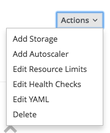
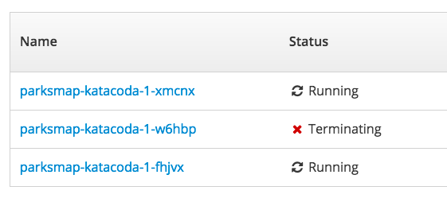

Let's scale our application up to 2 instances of the pods. You can do this by clicking the "up" arrow next to
the *Pod* in the OpenShift web console on the overview page.

To verify that we changed the number of replicas, click the pods number in the circle next to the arrows.
You should see a list with your pods similar to the following:

You can see that we now have 2 replicas.

Overall, that's how simple it is to scale an application (*Pods* in a
*Service*). Application scaling can happen extremely quickly because OpenShift
is just launching new instances of an existing image, especially if that image
is already cached on the node.

### Application "Self Healing"

Because OpenShift's *DeploymentConfigs* are constantly monitoring to see that the desired number
of *Pods* is actually running, you might also expect that OpenShift will "fix" the
situation if it is ever not right. You would be correct!

Since we have two *Pods* running right now, let's see what happens if we
"accidentally" kill one.

Open one of the pods by clicking it's name in the list.

In the top right corner of the page there is _Actions_, when opened, there is _Delete_ action.

**Click it!** And confirm the dialog. And you will be taken back to the page listing pods, however
this time, there are three pods.

The pod that we deleted is terminating, i.e. it is being cleaned up. And a new pod was created, because
OpenShift will always make sure, that if one pod dies, there is going to be new pod created to
fill it's place.

### Exercise: Scale Down

Before we continue, go ahead and scale your application down to a single
instance. It's as simple as clicking the down arrow on the _Overview_ page.
