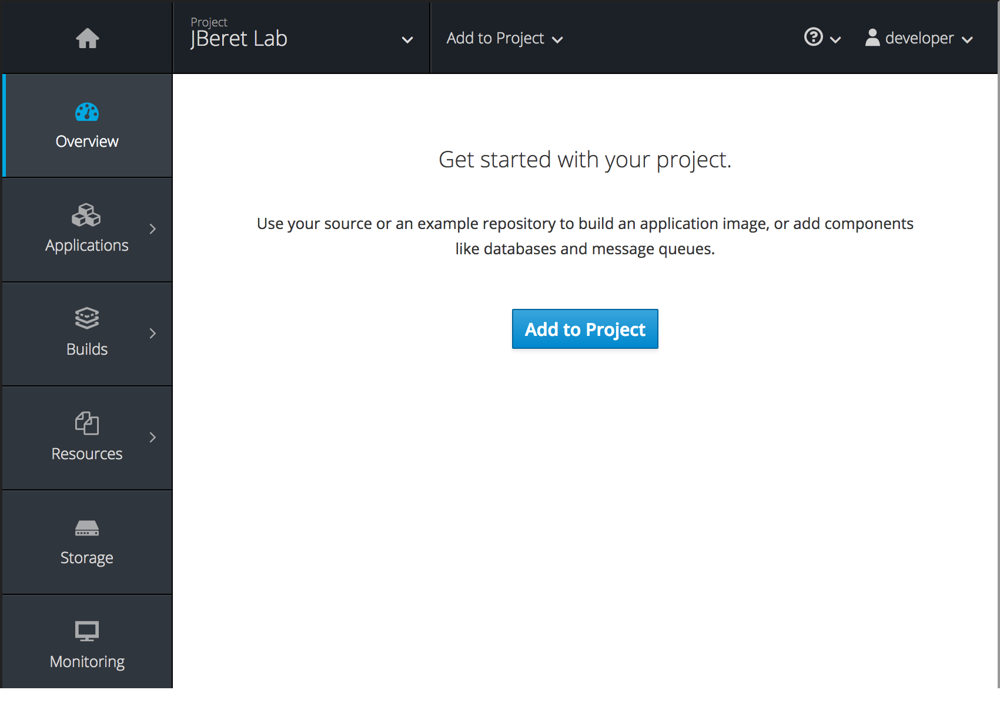
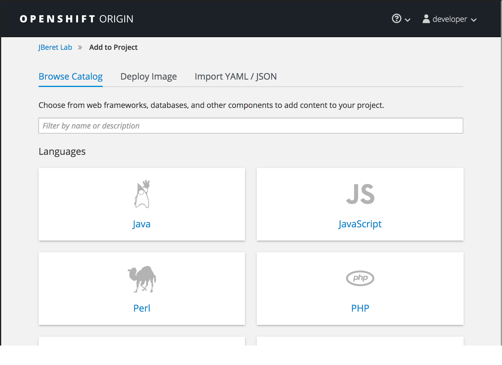
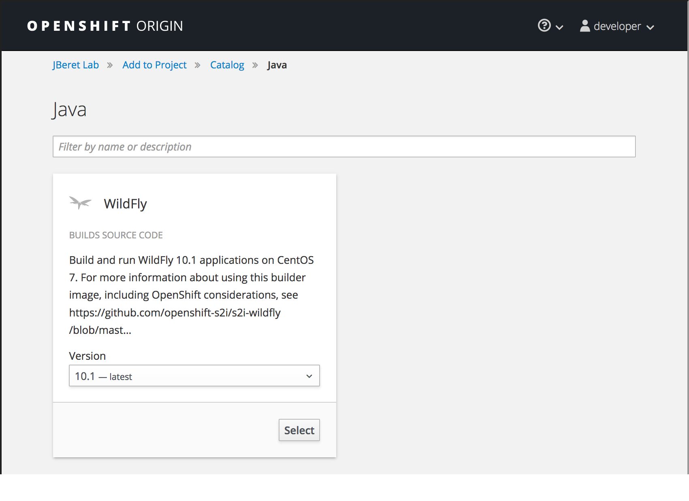
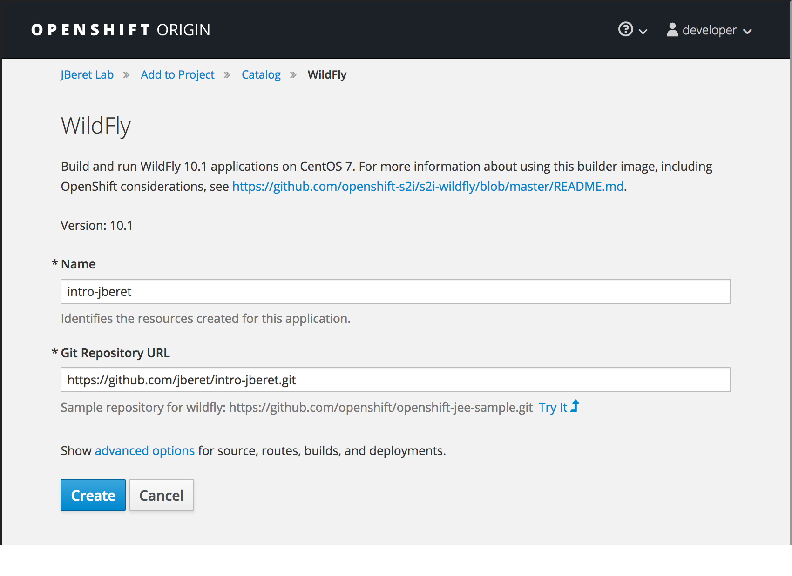
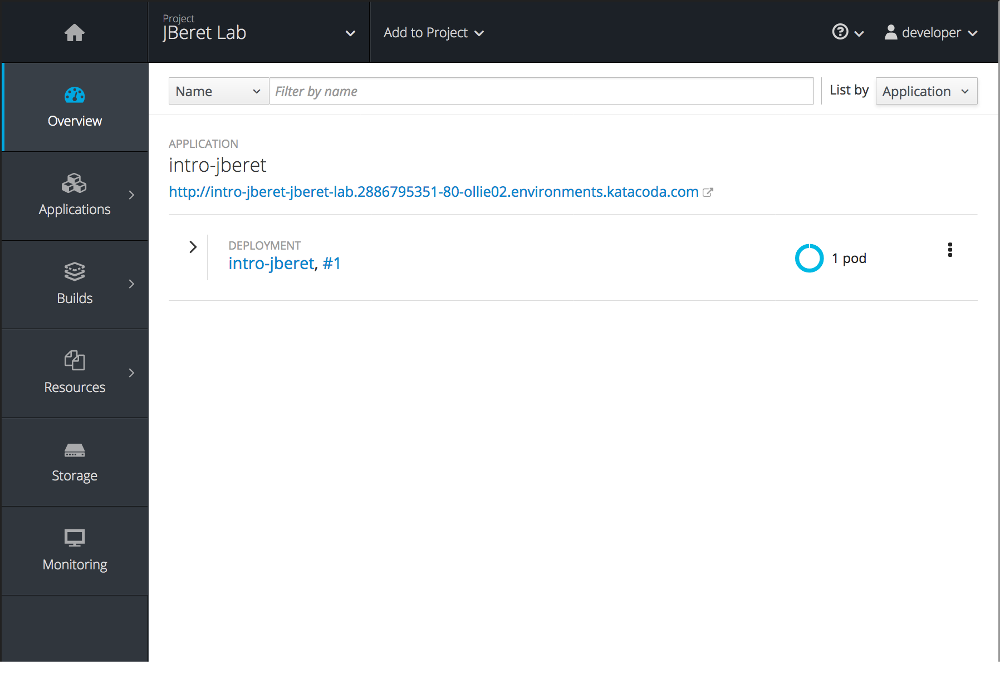
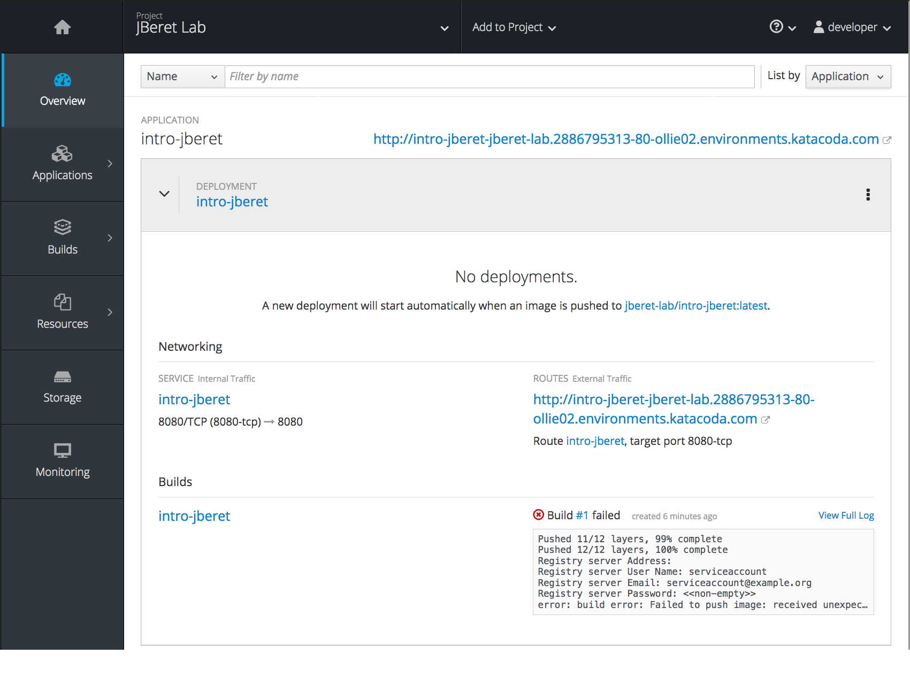

In the empty project, select the _Add to Project_ button in the centre of the page.

You should be presented with the catalog browser.

If applications had previously been deployed to the project, or you were not on the project _Overview_ page, you can use the _Add to Project_ link in the menu bar.

In this course you are going to deploy a batch application which is implemented as a Java webapp.

Select the _Java_ category from the catalog browser. Any options for deploying applications which are related to Java will be displayed.

In the environment used for this course, the only option presented will be that for the WildFly Source-to-Image (S2I) builder.

For this exercise leave the version as ``latest``, which in this environment maps to WildFly 10.1.

Click on _Select_ to bring up the deployment options for the WildFly S2I builder.

For the _Name_ to be given to resources, enter:

`intro-jberet`{{copy}}

For the _Git Repository URL_ enter:

`https://github.com/jberet/intro-jberet.git`{{copy}}

When you are ready, at the bottom of the page click on _Create_. This will take you to a splash page confirming the application has been created.

Click on _Continue to overview_ and you will be returned to the _Overview_ page, where you can view the details of the application created and monitor progress as it is built and deployed.

To view details of application build and deployment, expand _DEPLOYMENT intro-jberet_ panel:
[Can you please change this image to have a build success]

Here you can view full logs, and error messages if any. Once the build completes, 
click the URL under the application name ``intro-jberet``, which should be:

`https:// intro-jberet-jberet-lab.[[HOST_SUBDOMAIN]]-[[KATACODA_HOST]].environments.katacoda.com/`

This will take you to WildFly 10.1 landing page, which shows the application server is up and running.
