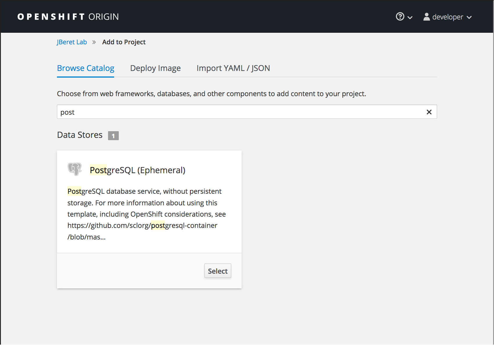
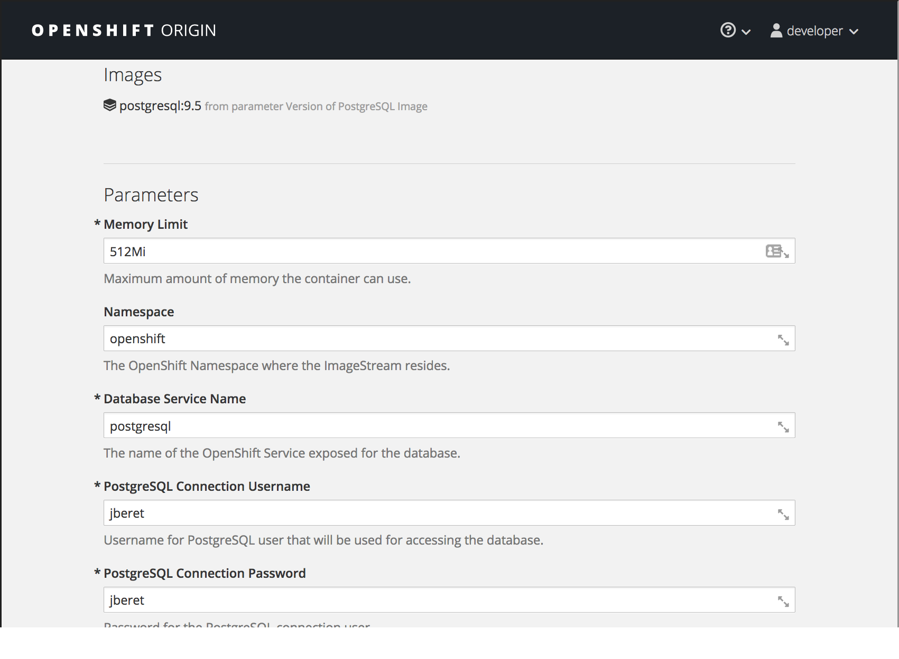
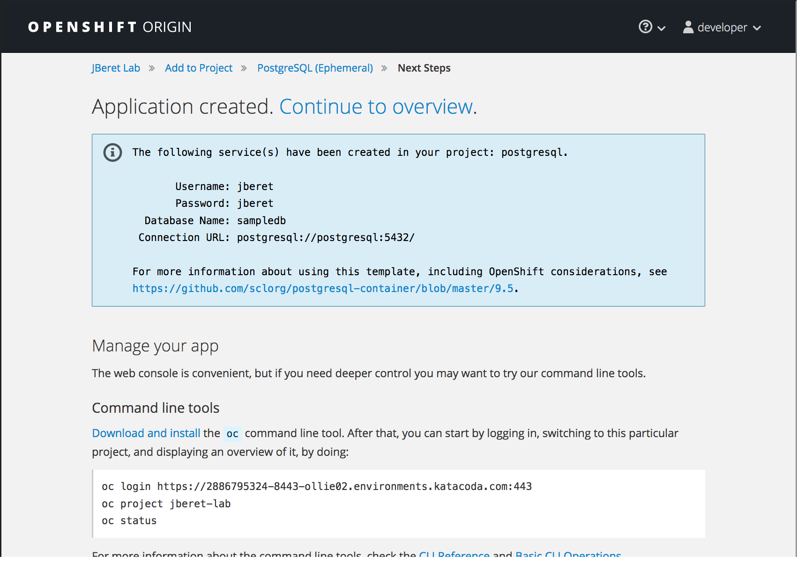

``intro-jberet`` app uses PostgreSQL database for storing output data. 
To create PostgreSQL database in OpenShift dashboard, 
navigate to _Add to Project_, then _Browse Catalog_, then _Data_Stores_, and finally select _postgresql-ephemeral_.
For quicker access, you can start typing ``postgre`` in the filter field.

Click _Select_ button.

Although a database would normally be paired with a persistent volume, we only want to demonstrate how to access the database in this course. The database instance we create here, will therefore only store the database in the filesystem local to the container. This means that if we delete the database containers, any changes would be lost. When you deploy a database to be used with your own applications, you would want to look at using persistent volumes.

On the details page **you must** enter a few database parameters. We will only specify database
user name and password, and leave other fields with default values.

* _PostgreSQL Connection Username_: ``jberet``{{copy}}
* _PostgreSQL Connection Password_: ``jberet``{{copy}}

Click _Create_ button, and the database is successfully created:

