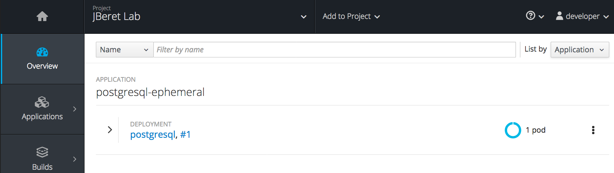
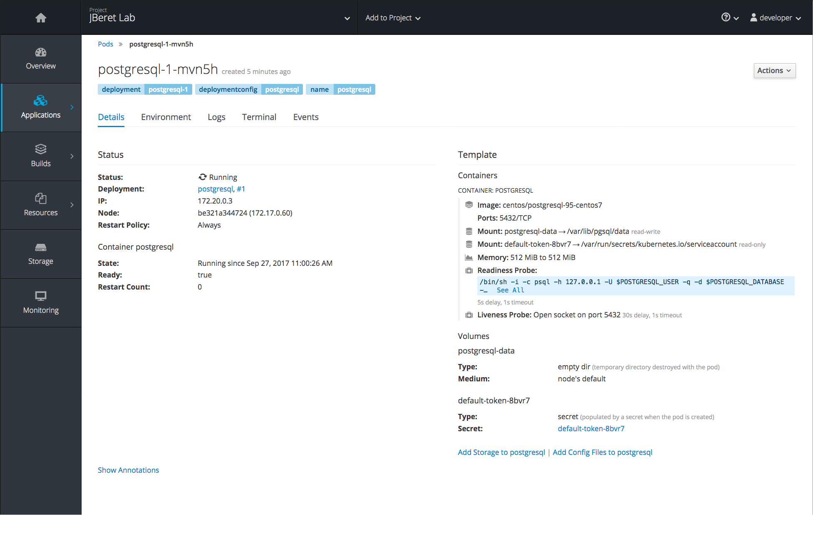
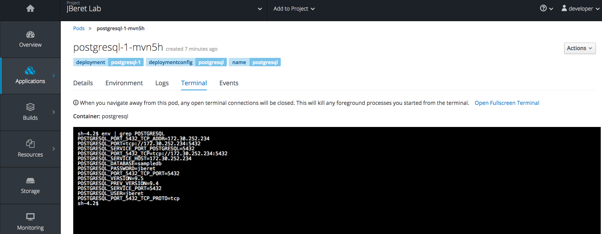

In this step, we will demonstrate how to view details of the newly-created PostgreSQL
database, and get database connection parameters. First go to dashboard _Overview_,
click PostgreSQL POD with blue circle:

It then takes you to the POD detail page, similar to the following:

Here you can view PostgreSQL POD details, environment variables, logs, events and access its terminal,
all available through the the menu tab near the top.

We will access the POD terminal to get the database connection info. Click the _Terminal_ tab, and
run ``env | grep POSTGRES`` command in this terminal:

Among all these PostgreSQL database parameters, we will need ``POSTGRESQL_SERVICE_HOST`` value, 
and rely on default values for other parameters. So copy its value, similar to ``172.30.245.228``,
by selecting it, right-clicking, and choosing _Copy_ in the context menu.

Save ``POSTGRESQL_SERVICE_HOST`` value in an environment variable in terminal. Switch to terminal,
and set the following environment variable. For example (your value is different):

``export DB=172.30.245.228``

Later when we run the batch application, we will reference ``$DB`` for the application
to connect to PostgreSQL database.