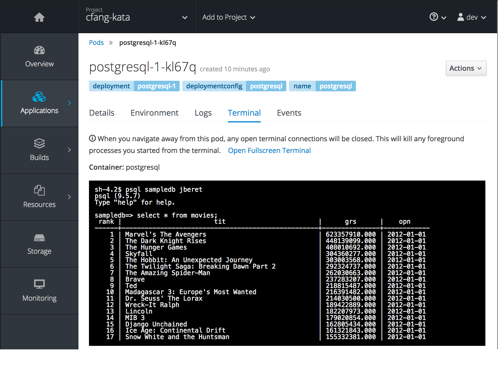

Now we are ready to run the batch application. This sample application contains a job
named ``csv2db``, which reads data from 
[an online CSV resource of movies](https://raw.githubusercontent.com/jberet/jsr352/master/jberet-support/src/test/resources/movies-2012.csv), 
and writes them in chunks to PostgreSQL database table ``MOVIES``.

To start the job named ``csv2db``

``curl -X POST -H 'Content-Type:application/json' "$APP/jobs/csv2db/start?db.host=$DB"``{{execute}}

```json
{
   "startTime":null,
   "endTime":null,
   "batchStatus":"STARTING",
   "exitStatus":null,
   "executionId":1,
   "href":"http://intro-jberet-jberet-lab.2886795305-80-ollie02.environments.katacoda.com/intro-jberet/api/jobexecutions/1",
   "createTime":1506284588752,
   "lastUpdatedTime":1506284588752,
   "jobParameters":null,
   "jobName":"csv2db",
   "jobInstanceId":1
}
```

The above command includes ``db.host`` query parameter for connecting to PostgreSQL database, assuming
other database parameters have the following default values:

* ``db.name: sampledb``
* ``db.user: jberet``
* ``db.password: jberet``

If you've configured different values when creating PostgreSQL, you will need to include them as additional
query parameters in test URL.

To get details and status of a job execution, just follow the href link given above 
(your job execution id may be different):

``curl $APP/jobexecutions/1``{{execute}}

The output is the same as above, except that the job has completed and its batch status 
should be ``COMPLETED``

To get all step executions belonging to a job execution (your job execution id may be different):

``curl $APP/jobexecutions/1/stepexecutions/``{{execute}}

The output should include 2 step executions (details omitted here).

To get details for a step execution (your job and step execution id may be different):

``curl $APP/jobexecutions/1/stepexecutions/2``{{execute}}

```json
{
   "startTime":1506284589019,
   "endTime":1506284591953,
   "batchStatus":"COMPLETED",
   "exitStatus":"COMPLETED",
   "stepExecutionId":2,
   "stepName":"csv2db.step2",
   "metrics":[
      {
         "type":"WRITE_COUNT",
         "value":100
      },
      {
         "type":"ROLLBACK_COUNT",
         "value":0
      },
      {
         "type":"FILTER_COUNT",
         "value":0
      },
      {
         "type":"WRITE_SKIP_COUNT",
         "value":0
      },
      {
         "type":"PROCESS_SKIP_COUNT",
         "value":0
      },
      {
         "type":"COMMIT_COUNT",
         "value":11
      },
      {
         "type":"READ_SKIP_COUNT",
         "value":0
      },
      {
         "type":"READ_COUNT",
         "value":100
      }
   ]
}
```
Just some notes about the step metrics:

* ``READ_COUNT: 100`` indicates 100 items were read from CSV; 
* ``WRITE_COUNT: 100`` indicates 100 items were written to database
* ``COMMIT_COUNT: 11`` indicates all these items were split into chunks with 11 transactions

To check PostgreSQL database table content, switch to OpenShift dashboard, 
select PostgreSQL POD, and then click _Terminal_ tab to launch the web terminal.

Inside PostgreSQL POD web terminal, run ``psql`` tool with ``sampledb`` as database name
and ``jberet`` as user name:

``psql sampledb jberet``{{copy}}

Inside ``psql`` tool, issue the following SQL statement, and the query result should have
100 rows of movie data:

``select * from MOVIES;``{{copy}}




