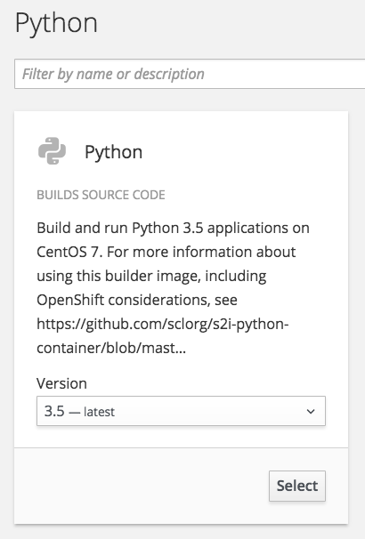
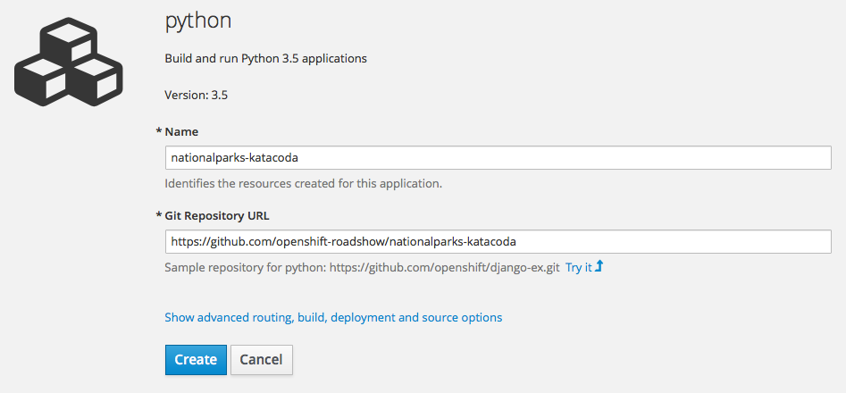

In this lab, you are going to deploy a backend service for the ParksMap application. This backend service will provide data, via a REST service API, on major national parks from all over the world. The ParksMap front end web application will query this data and display it on an interactive map in your web browser.

# Background: Source-to-Image (S2I)

In a previous lab, you learned how to deploy an application (the ParksMap front end) from a pre-existing Docker-formatted image. Here you will learn how to deploy an application direct from source code hosted in a remote Git repository. This will be done using the [Source-to-Image (S2I)](https://github.com/openshift/source-to-image) tool.

The documentation for S2I describes itself in the following way:

> Source-to-image (S2I) is a tool for building reproducible Docker images. S2I
produces ready-to-run images by injecting source code into a Docker image and
assembling a new Docker image which incorporates the builder image and built
source. The result is then ready to use with docker run. S2I supports
incremental builds which re-use previously downloaded dependencies, previously
built artifacts, etc.

OpenShift is S2I-enabled and can use S2I as one of its build mechanisms (in addition to building Docker images from Dockerfiles, and "custom" builds).

A full discussion of S2I is beyond the scope of this lab. More information about S2I can be found in the [OpenShift S2I documentation](https://docs.openshift.org/latest/creating_images/s2i.html) and the [GitHub project respository for S2I](https://github.com/openshift/source-to-image).

The only key concept you need to remember about S2I is that it's magic.

# Exercise: Deploying the application code

The backend service that you will be deploying in this lab is called ``nationalparks-katacoda``. This is a Python application that will return map coordinates of major national parks from all over the world as JSON, via a REST service API. The source code repository for the application can be found on GitHub at:

* https://github.com/openshift-roadshow/nationalparks-katacoda

To deploy the application you are again going to use the *Add to Project* feature of the OpenShift web console, so ensure you have the OpenShift web console open and that you are in the project called ``myproject``. Find and select the *Add to Project* link in the top menu bar for the project. This time, rather than using *Deploy Image* you want to use *Browse Catalog*.

Select Python in the list of supported languages.

Ensure that the Python version is '3.5' and click on *Select*. This will bring up the main page for specifying the details of a Python application to deploy.

For the the *Name* of the application use:

``nationalparks-katacoda``{{copy}}

For the *Git Repository URL* use:

``https://github.com/openshift-roadshow/nationalparks-katacoda``{{copy}}

The *Name* needs to be ``nationalparks-katacoda`` as the front end for the ParksMap application is expecting the backend service to use that name.

Click on *Create*, and then *Continue to overview*. In the overview page of the web console you should now see both the front end web application and the backend web service you just deployed.

You will see that initially a build is running for the Python application. This is the step where S2I is run on the application source code from the Git repository to create the image which will then be run. Click on the *View Full Log* link for the build and you can follow along as the S2I builder for Python, downloads all the Python packages required to run the application, prepares the application, and creates the image.

Head back to the *Overview* page when the build completes to see the image being deployed and made running.

With the backend service for the ParksMap application now deployed, if you return to the front end in your web browser, you should now be able to see the locations of the national parks displayed.

