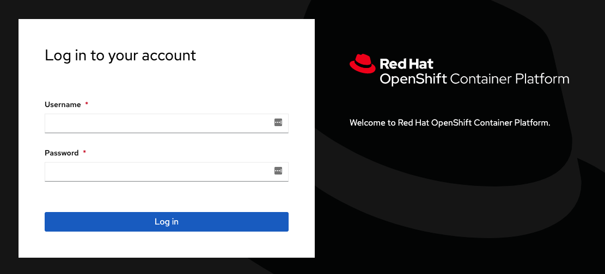
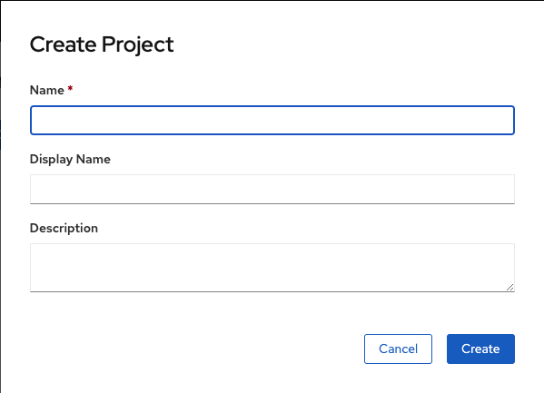

The easiest way to access and interact with OpenShift is through the web console. The URL for the web console will be dictated by what was specified as the public URL for the OpenShift cluster when it was set up. Once the web console is accessed, how you then login will depend on the configured identity provider.

For this course the public URL for the web console is:

``https://console-openshift-console-[[HOST_SUBDOMAIN]]-443-[[KATACODA_HOST]].environments.katacoda.com``{{copy}}

To view the web console at the same time as these instructions, you can also select the _Console_ tab to the right of the tab for the embedded _Terminal_.

In the case of the OpenShift cluster managing user authentication, the web console login page will prompt you for your _Username_ and _Password_.

In the case of an external authentication service being used as the identity provider, it will be necessary to login first to the external service. As an example, if you were accessing [OpenShift Online](https://www.openshift.com/get-started/) you would see:

For the OpenShift cluster used in this course, as the OpenShift cluster is managing user authentication, you will be presented with a login page that prompts you for your user account credentials. You can login using the credentials:

* **Username:** ``developer``{{copy}}
* **Password:** ``developer``{{copy}}

As this is the first time you have logged in as this user in this OpenShift cluster, you will be presented with a "Welcome to OpenShift" message and the option of creating a new project.

Create a new project by selecting _Create Project_. Call the project ``myproject``{{copy}}.

Upon creating a project you will be left on the overview page for the new project.

If you want to get to a list of all the projects you have available, you can select "Home->Projects" from the left hand side menu. If you do not see the menu, you can click on the hamburger menu item button in the top level corner of the web console.

