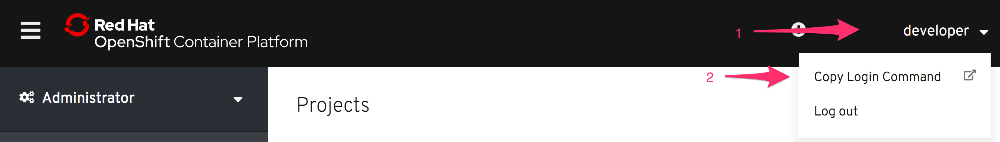

The OpenShift web console provides a convenient method for quickly interacting with and viewing the state of applications you have deployed using OpenShift. Not everything you may want to do can be done through the web console. You will therefore also need to be familiar with using the OpenShift command line tool ``oc``.

In this course the embedded _Terminal_ provided to you already has ``oc`` installed so you do not need to download and install the ``oc`` client.

If you were using a different OpenShift cluster and did not already have the ``oc`` command line tool, you can download it by following the links in the _Command Line Tools_ menu option of the web console.


Depending on the version of OpenShift which has been installed and how it was setup, you may see a single link here off to the downloads for the latest release, or multiple links to platform specific variants of the archive containing the ``oc`` binary. You would need to download the archive specific to your platform, extract the ``oc`` binary and install it.

To login to the OpenShift cluster used for this course run:

``oc login https://[[HOST_SUBDOMAIN]]-8443-[[KATACODA_HOST]].environments.katacoda.com``{{execute}}

This will prompt you to enter your _username_ and _password_. Use the credentials:

* **Username:** ``developer``
* **Password:** ``developer``

You should see output similar to:

```
Authentication required for https://....environments.katacoda.com (openshift)
Username: developer
Password:
Login successful.

You have one project on this server: "myproject"

Using project "myproject".
```

Once logged in, you can verify what user you are logged in by running:

``oc whoami``{{execute}}

You can verify which server you are logged into by running:

``oc whoami --show-server``{{execute}}

You can list all the projects you currently have access to by running:

``oc get projects``{{execute}}

In the case of an external authentication service being used as the identity provider, the required steps are a bit different.

If you login using ``oc login`` on the command line you will be presented with an error message:

```
Login failed (401 Unauthorized)
You must obtain an API token by visiting
  https://api.starter-us-east-1.openshift.com/oauth/token/request
```

You would visit the link given, logging in first via the separate authentication service if necessary. This will land you at a page looking like:


In this case, rather than use your actual user credentials to login using ``oc login``, you use a special access token provided by that web page. The web page lists the specific ``oc login`` command to run.

Even in the case where user authentication is managed by the OpenShift cluster and user credentials are accepted, you can opt to instead use an access token. You can retrieve the command to run by manually entering the ``/oauth/token/request`` URL against the OpenShift cluster being used. Or you can instead retrieve it from the _Command Line Tools_ page you use to download the ``oc`` command line tool.

 

Whichever mechanism you use to login from the command line using ``oc login``, the login will periodically expire and you will need to login again. The expiration period is typically 24 hours.
