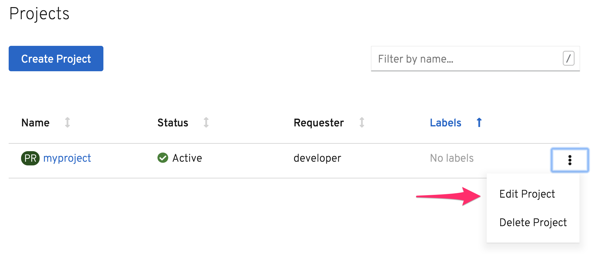
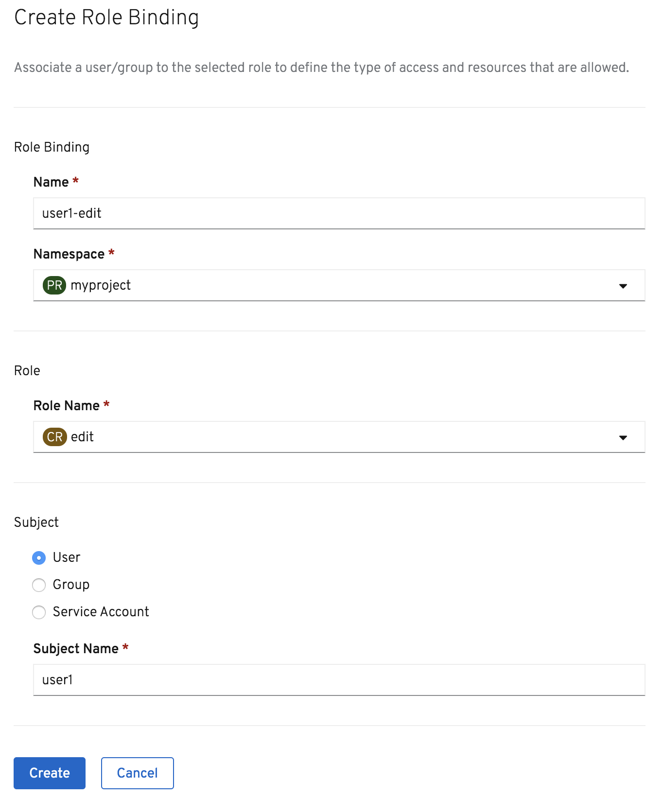

Working alone can be lots of fun, but as your application grows you may want to get others to help. This is no problem with OpenShift as it is built to be multi tenant. This means it can support many different users, each working on their own applications. To support collaboration on the same project, you can also grant other users access to any of your projects. Access can be granted at varying levels depending on what they need to be able to do in your project.

To test out how users can collaborate, we need another user.

Login from the command line as the user ``user1`` by running:

``oc login --username user1 --password user1``{{execute}}

This is the first time this user has logged in, so if you run:

``oc get projects``{{execute}}

you should see that the user has access to no projects.

To grant this user access to your project, go to the list of projects in the web console and select on the drop down menu to the right of the project name and select on _Edit Project_.

When the project details are displayed, select on the _Role Bindings_ tab.

You will see that only the ``developer`` user is a member of the project at this point, with the user having `admin` access.

Click on _Create Binding_ to grant an additional user access to the project.

For the name of the role binding use ``user1-edit``{{copy}}.

Ensure that the ``myproject`` namespace is selected, and with the role name as ``edit``.

Finally enter ``user1``{{copy}} as the subject name.

Click on _Create_.

The user ``user1`` is now a member of the project. Back in the _Terminal_ run again the command:

``oc get projects``{{execute}}

This should show that ``user1`` now has access to the project created by the ``developer`` user.

In this case you gave ``user1`` the role type ``edit`` in the project. This allows the user to perform most tasks within the project, with the exception of tasks related to administration of the project. The user therefore cannot make changes to project membership or delete the project.

Other roles you might instead assign to a collaborator are ``view``, which means they can look at everything in the project, but not change anything, or ``admin``, which gives them equal rights as the owner of the project, including editing project membership or deleting the project.

Making changes to project membership can also be done from the command line using ``oc``.

As ``user1`` has no projects at this point, create one by running:

``oc new-project mysecrets``{{execute}}

Then add the ability for ``developer`` to also view that project by running:

``oc adm policy add-role-to-user view developer -n mysecrets``{{execute}}

Return to the main page in the web console where the list of projects is shown for ``developer`` and you should
see ``mysecrets`` listed.
