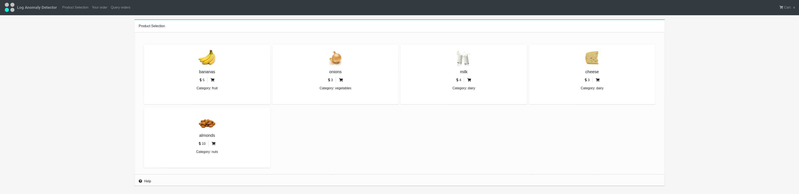
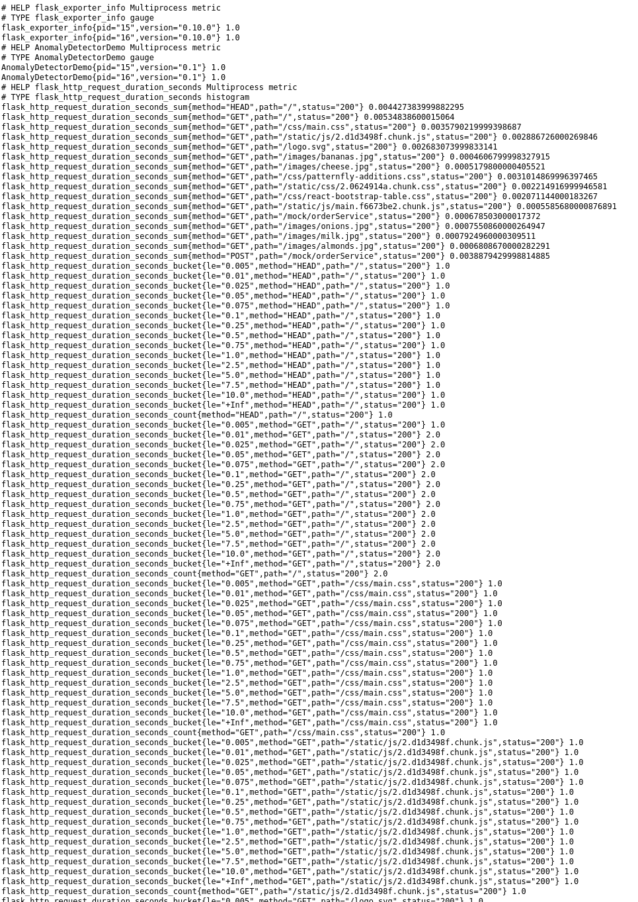

## Playing with the demo application

The demo application is a simulated E-commerce food store application that also exposes some of it's metrics (the food store application might take up to an additional minute to be initialized).

### Generating some metrics

The url for the food store is: http://metrics-demo-app-metrics-demo.[[HOST_SUBDOMAIN]]-80-[[KATACODA_HOST]].environments.katacoda.com/

* Once you are able to access the food store application, play around with it,
try to buy the products you like [Everything here is free ;) ].
* When you play around with the food store, you make the server serve some requests (GET/POST/..),  
some of the metrics for these requests are generated and exposed for Prometheus to collect.

### Exposed metrics
The exposed metrics can be found here: http://metrics-demo-app-metrics-demo.[[HOST_SUBDOMAIN]]-80-[[KATACODA_HOST]].environments.katacoda.com/metrics

* This is the endpoint where Prometheus will scrape (collect) metrics from periodically and store them on a persistent storage device like a hard drive (Using [OpenShift PersistentVolumes](https://docs.openshift.com/container-platform/4.2/storage/understanding-persistent-storage.html#persistent-storage-overview_understanding-persistent-storage)).

* If you don't see similar metrics (pictured above) in your environment, try to make an order with the ecommerce application to generate a few metrics.
