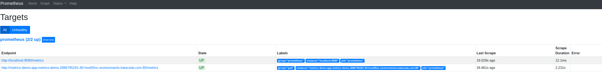

### Namespace for monitoring

We have created a [namespace](https://docs.openshift.com/container-platform/4.2/applications/projects/working-with-projects.html) called `pad-monitoring` on OpenShift where we will deploy all our monitoring applications (Prometheus and Grafana).

* To make sure we are using our namespace run the following command:  
`oc project pad-monitoring`{{execute}}

* You can also go to the OpenShift console and login to the namespace [there](https://console-openshift-console-[[HOST_SUBDOMAIN]]-443-[[KATACODA_HOST]].environments.katacoda.com/k8s/cluster/projects/pad-monitoring).

* The credentials to access the OpenShift console are:
  * **Username:** ``developer``{{copy}}
  * **Password:** ``developer``{{copy}}

### Configure Prometheus for our application

In OpenShift, we use ConfigMaps to manage configurations for our applications ([more info](https://docs.openshift.com/container-platform/3.11/dev_guide/configmaps.html#overview)).

* We will use the following ConfigMap to set up our Prometheus instance.

<pre class="file" data-filename="~/prometheus-configmap.yaml" data-target="replace">
apiVersion: template.openshift.io/v1          # Click on 'Copy to Editor' --->
kind: Template
objects:
  - apiVersion: v1          
    kind: ConfigMap
    metadata:
      name: prometheus-demo
      namespace: pad-monitoring
    data:     
      prometheus.yml: |     # Prometheus configuration starts below
        global:                   
          external_labels:
            monitor: prometheus
        scrape_configs:
          - job_name: 'prometheus'

            static_configs:
              - targets: ['localhost:9090'] # Configure Prometheus to scrape itself
                labels:
                  group: 'prometheus'
</pre>

* Click on `Copy to Editor` for the above yaml block, to copy it to the editor.
This will replace all the text in the editor with the above yaml text block

* Now we need to edit the ConfigMap for our Prometheus deployment, so that Prometheus knows to scrape our demo application for metrics.
To do that, we need to add the following section:

<pre class="file" data-filename="~/prometheus-configmap.yaml">
              - targets: ['metrics-demo-app-metrics-demo.[[HOST_SUBDOMAIN]]-80-[[KATACODA_HOST]].environments.katacoda.com'] # Click on 'Copy to Editor'->
                labels:
                  group: 'pad'
</pre>

In the above yaml block, we have defined a new targets list for our Prometheus to collect metrics from.

This targets list has the hostname for our demo application, i.e. `metrics-demo-app-metrics-demo.[[HOST_SUBDOMAIN]]-80-[[KATACODA_HOST]].environments.katacoda.com`

By default Prometheus collects metrics from the `/metrics` http endpoint. ([More info](https://prometheus.io/docs/prometheus/latest/configuration/configuration/) on Prometheus Configuration)

Above, you can see that we have added a label `group: 'pad'`  
So all the metrics from our demo application can be
queried with a singe PromQL query, i.e. `{group="pad"}`{{copy}}

The ConfigMap file should be stored in a file named `prometheus-configmap.yaml`{{open}},  
we will use it to update our Prometheus instance in the next step.

### Deploy Prometheus with new configuration

* Once we have updated the configuration with our new target, we can go ahead and update this ConfigMap in our namespace:  
`oc process -f ~/prometheus-configmap.yaml | oc apply -f -`{{execute}}

* Update the Prometheus deployment using the following command:  
`oc rollout latest dc/prometheus-demo -n pad-monitoring`{{execute}}

After this, it might take a couple minutes for the Prometheus server to be ready to take requests.

The Prometheus Console should be available [here](http://prometheus-demo-route-pad-monitoring.[[HOST_SUBDOMAIN]]-80-[[KATACODA_HOST]].environments.katacoda.com)

You can also use the [OpenShift dashboard](https://console-openshift-console-[[HOST_SUBDOMAIN]]-443-[[KATACODA_HOST]].environments.katacoda.com/k8s/ns/pad-monitoring/deploymentconfigs/prometheus-demo) to check on the Prometheus deployment.

* The credentials to access the OpenShift console are:
  * **Username:** ``developer``{{copy}}
  * **Password:** ``developer``{{copy}}

### Check if the configuration was updated successfully
Once the Prometheus server is ready to take requests,  
* Visit the targets page for Prometheus, [here](http://prometheus-demo-route-pad-monitoring.[[HOST_SUBDOMAIN]]-80-[[KATACODA_HOST]].environments.katacoda.com/targets).  
  The targets page should show you a list of targets that Prometheus has been configured to collect metrics from.

It should look something like:

* If you cannot find the demo application, in the targets list,  
Try to fix your Prometheus configuration in the ConfigMap file `prometheus-configmap.yaml`{{open}} and repeat the previous step.

### Check application metrics
* Once Prometheus is deployed, you can click [here](http://prometheus-demo-route-pad-monitoring.[[HOST_SUBDOMAIN]]-80-[[KATACODA_HOST]].environments.katacoda.com/graph?g0.range_input=1h&g0.expr={group%3D"pad"}) to see all the metrics for the demo application.
  This should query the Prometheus instance for all the metrics with the label `group="pad"`.

* To learn more about the Prometheus query language or PromQL you can visit [this page](https://prometheus.io/docs/prometheus/latest/querying/basics/#querying-prometheus).
