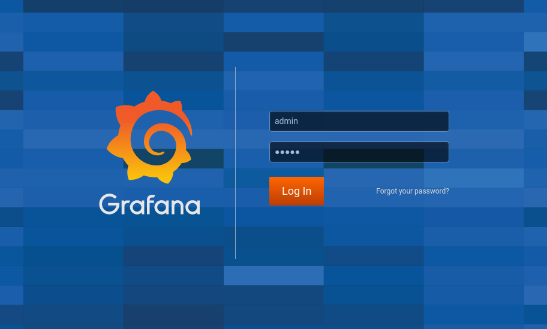
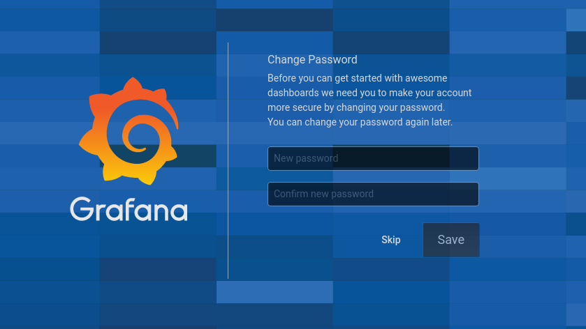
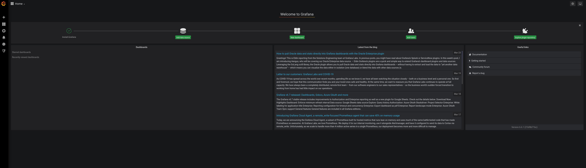
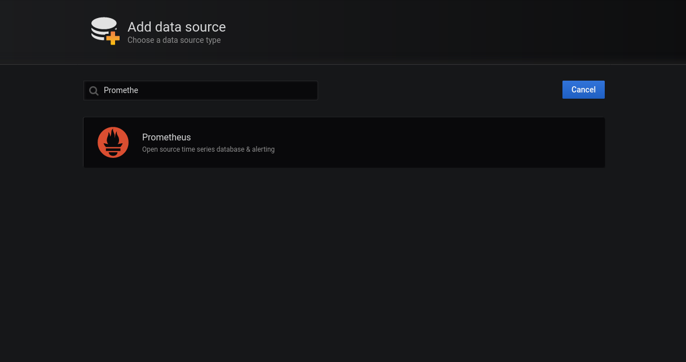
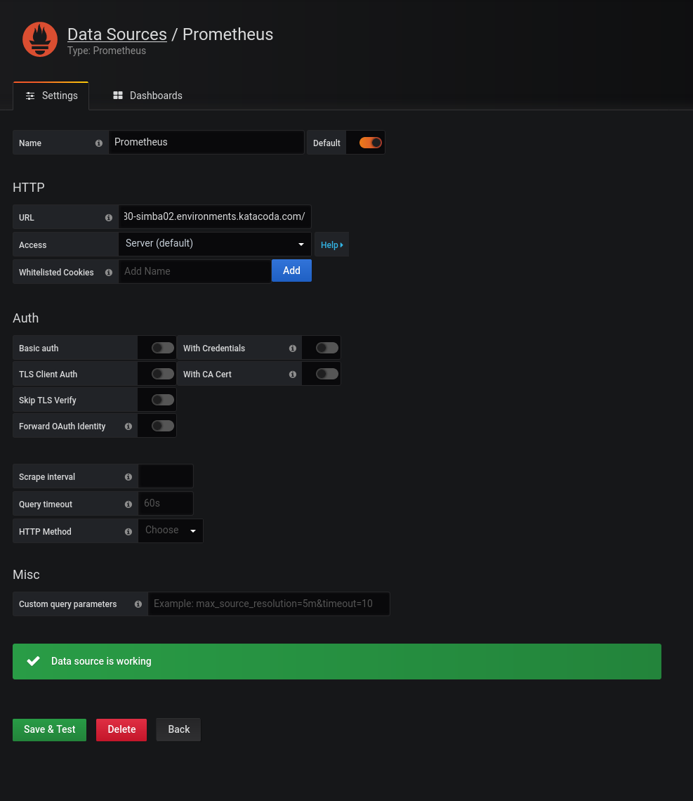

## Setting up Grafana to Visualize Metrics

Now, we will deploy Grafana and connect it to our Prometheus instance, so we are able to visualize metrics better.

### Deploying Grafana

* We can just directly deploy the container image from [Docker Hub](https://hub.docker.com/r/grafana/grafana/) using the following command: <br>
`oc new-app grafana/grafana:6.6.1 -n pad-monitoring`{{execute}}

  You should see some output like this:

  ```
  --> Creating resources ...
      imagestream.image.openshift.io "grafana" created
      deploymentconfig.apps.openshift.io "grafana" created
      service "grafana" created
  --> Success
      Application is not exposed. You can expose services to the outside world by executing one or more of the commands below:
       'oc expose svc/grafana'
      Run 'oc status' to view your app.
  ```

* Then we need to expose the service so that it is accessible outside of the cluster. <br>
`oc expose svc/grafana -n pad-monitoring`{{execute}}

* In about a minute, the Grafana console should be available at: <br>
http://grafana-pad-monitoring.[[HOST_SUBDOMAIN]]-80-[[KATACODA_HOST]].environments.katacoda.com

The default credentials for grafana are:
  * username: `admin`{{copy}}
  * password: `admin`{{copy}}

  

* Next it will prompt you to change the default credentials, <br>
you can safely skip this for the purposes of this exercise.  <br>


* Next you should see the Grafana Welcome page <br>


### Configuring Grafana to visualize metrics from Prometheus

* On the Grafana Welcome page, click on `Add data source` button to add Prometheus as a data source.

* You should see list of grafana compatible data source types, you can type in `Prometheus` to filter the results. <br>


* When you click on the Prometheus Data Source, you should see the Data Source settings. <br>


  * Fill the URL in the HTTP section with the Prometheus URL: <br>
`http://prometheus-demo-route-pad-monitoring.[[HOST_SUBDOMAIN]]-80-[[KATACODA_HOST]].environments.katacoda.com`{{copy}}

  * Then click on `Save & Test`, this should test the connection to the Prometheus server.

That's it, the connection between Grafana and Prometheus has been configured!
