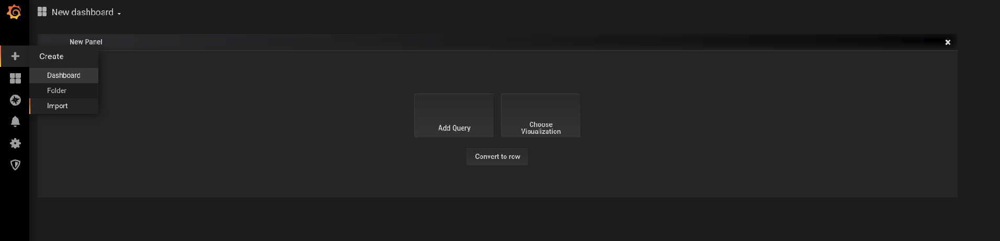
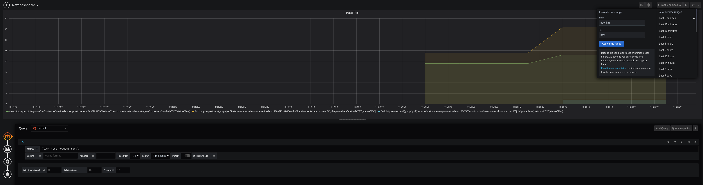
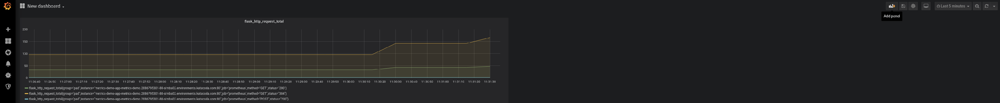
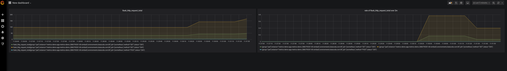

## Visualizing Metrics using Grafana

Now, we will create a dashboard in Grafana and visualize a simple metric from the food store application.

We will visualize a metric called `flask_http_request_total`, it is the total number of requests served by the food store application.

### Creating a Dashboard

* Let's start with creating a dashboard for our visualizations.

* In the left panel, click on `Create` and then select `Dashboard`  

### Creating a Panel

* You should see a New Panel like in the picture above. Click on `Add Query`.

  You can have multiple panels in a single dashboard, and each panel supports different types of visualizations ([more info](https://grafana.com/docs/grafana/latest/guides/getting_started/#all-users)). 
  But here we will just look at line charts as we are dealing with time-series data.

* Below the graphing area, you should have an empty text box for your PromQL queries.  
Enter your query `flask_http_request_total`{{copy}}

* In the upper right corner, you can change the graphing duration.  
Change the duration to `Last 5 minutes`.  

  *you can choose any other value as well just keep in mind
that we have just set up the food store application monitoring, so only very recent metric values might be available.*

* Once you can see some lines in your graphing area, click on the left arrow (`<-`) in the upper left corner.

* Now you should have a dashboard with a single panel, let's add another panel with a different metric.

* In the upper right corner of the dashboard page, click on `Add Panel` and repeat the previous steps only this time
use a different query.  
`rate(flask_http_request_total[2m])`{{copy}} this should give you the rate of requests served by the application over 2 minutes.

* Once you have set up the second panel, your dashboard should look something like this  

If you want to see live changes to the dashboard, go to the [food store application page](http://metrics-demo-app-metrics-demo.[[HOST_SUBDOMAIN]]-80-[[KATACODA_HOST]].environments.katacoda.com/) and make some purchases.  
Then click on the refresh button in the upper right corner.

That's it! you should have your own monitoring dashboard now.

**You can do a lot more with dashboards like saving them, exporting as jsons, using variables, etc.  
You can learn more about dashboards [here](https://grafana.com/docs/grafana/latest/features/dashboard/dashboards/)**
