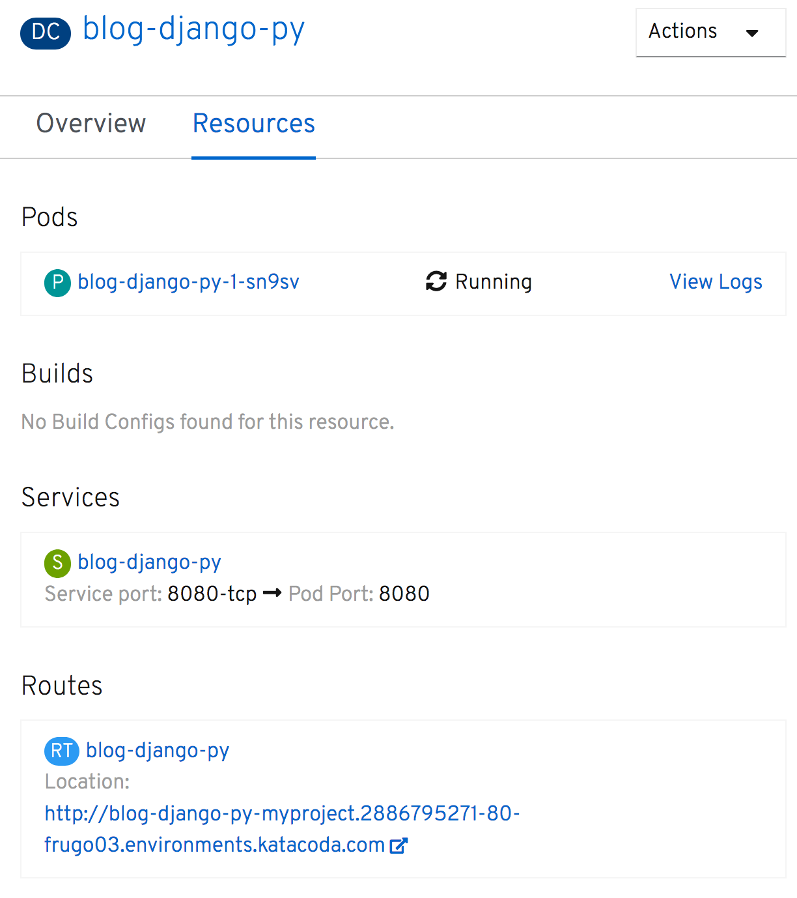

To drill down and get further details on the deployment, click in the middle of the ring. This will result in a panel sliding out from the right hand side providing access to both an _Overview_:

and details on _Resources_ related to the deployment.

From the _Overview_ for the deployment, you can adjust the number of replicas, or pods, by clicking on the up and down arrows to the right of the ring.

The public URL for accessing the application can be found under _Resources_.

If you dismiss the panel, you can also access the application via its public URL, by clicking on the URL shortcut icon on the visualization of the deployment.

