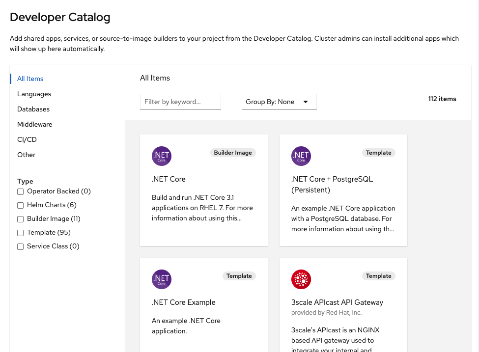
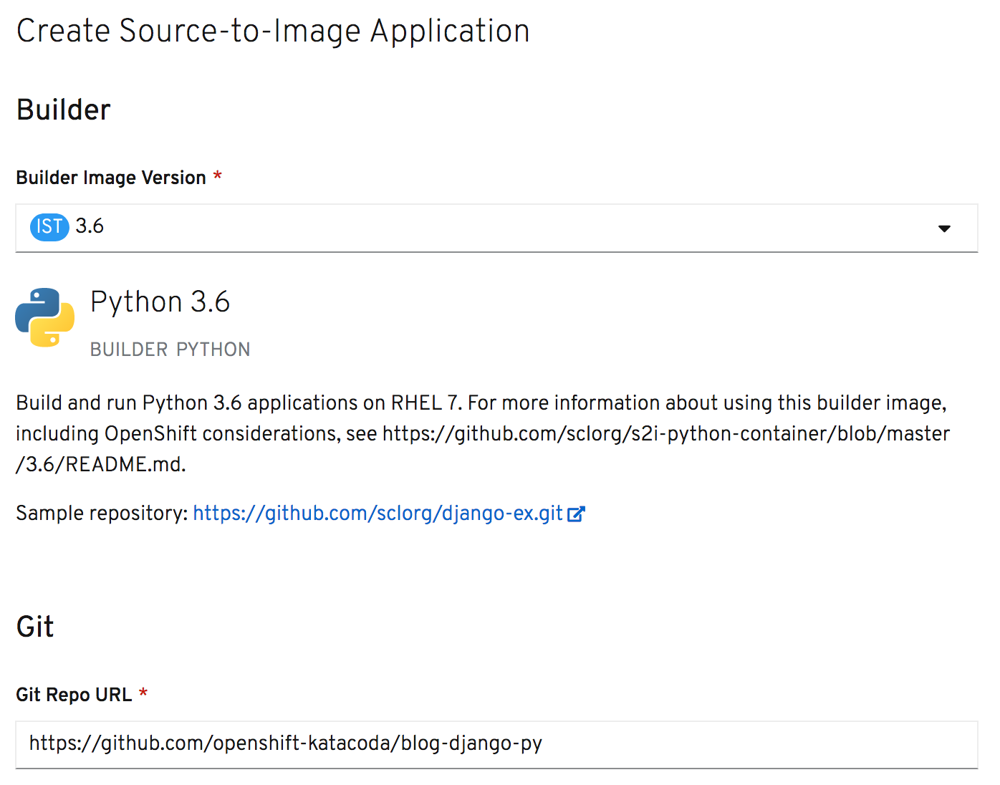
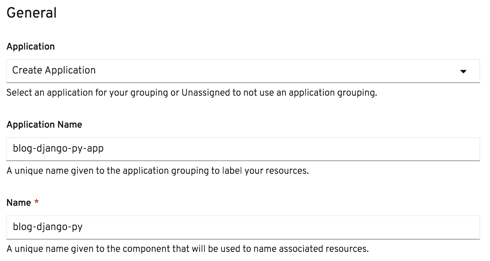
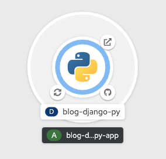
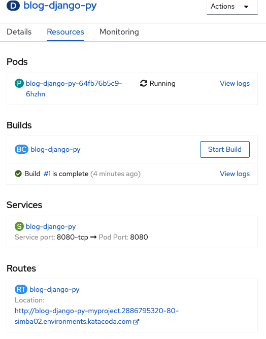

From the options presented for deploying an application, select _From Catalog_. This will land you on the _Developer Catalog_.

In this course you are going to deploy a web application which is implemented using the Python programming language.

If no items are displayed when you view the _Developer Catalog_, uncheck _Operator Backed_ in the _Type_ filters on the left hand side. Click on _Languages_ on the left hand side and then select _Python_. Any options for deploying applications which are related to Python will be displayed.

Click on the _Python_ tile for the generic Python Source-to-Image (S2I) builder. This will bring up a dialog with the details of the builder image. Click on _Create Application_ in the dialog.

Under the _Git_ settings, in the _Git Repo URL_ enter:

`https://github.com/openshift-katacoda/blog-django-py`{{copy}}

Scroll down to the _General_ settings and click on the _Application Name_ field.

When you click on the _Application Name_ field, the settings in this section should be pre-populated with values based on the Git repository name. Leave the settings with their default values.

When you are ready, at the bottom of the page click on _Create_. This will create resources to manage the build and deployment of the application. You will then be redirected to the topology overview for the project.

The topology overview provides a visual representation of the application you have deployed.

The Git icon shown to the lower right of the ring can be clicked on to take you to the hosted Git repository from which the source code for the application was built.

The icon shown to the lower left represents the build of the application. The icon will change from showing an hour glass, indicating the build is starting, to a sync icon indicating the build is in progress, and finally to a tick or cross depending on whether the build was successful or failed. Clicking on this icon will take you to the details of the current build.

Once the application is running, the icon shown to the upper right can be clicked to open the URL for the application route which was created.

The ring itself will progress from being white, indicating the deployment is pending, to light blue indicating the deployment is starting, and blue to indicate the application is running. The ring can also turn dark blue if the application is stopping.

Clicking anywhere on the area enclosed by the ring will bring up a panel giving details of the resources for the application, and access to a general overview of the deployment.

