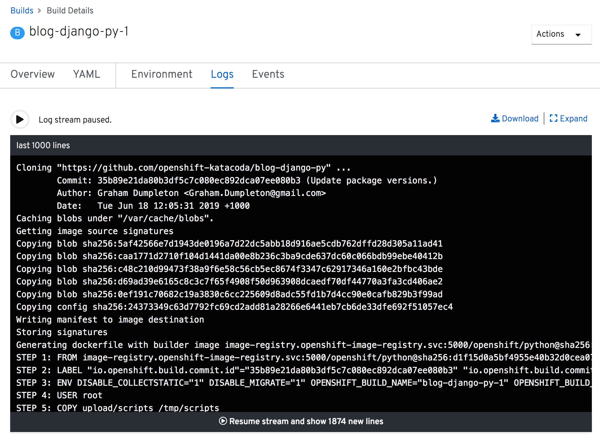

Once the build has started, click on the _View Logs_ link shown on the _Resources_ panel.

This will allow you to monitor the progress of the build as it runs. The build will have completely successfully when you see a final message of "Push successful". This indicates that the container image for the application was pushed to the OpenShift internal image registry.
