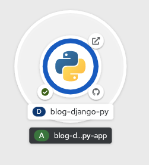

Once the build of the application image has completed, it will be deployed.

Click on _Topology_ in the left hand menu bar to return to the topology view for the project.

When you created the application using the web console, a _Route_ was automatically created for the application and it will be exposed outside of the cluster. The URL which can be used to access the application from a web browser was visible on the _Resources_ tab for the application you viewed previously.

From the topology view, you can quickly get to the URL for the deployed application by clicking on the icon top right of the ring in the visualisation for the application.

Wait for the ring to turn from light blue to blue to indicate the deployment is complete. Now click on the icon and you should see the blog application you deployed.

