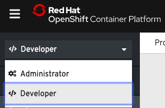
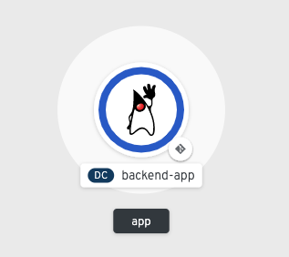

As mentioned, applications often consist of two or more components that work together to implement the overall application. OpenShift helps organize these modular applications with a concept called, appropriately enough, the application. An OpenShift application represents all of an app's components in a logical management unit. The `odo` tool helps you manage that group of components and link them together as an application.

A selection of runtimes, frameworks, and other components are available on an OpenShift cluster for building your applications. This list is referred to as the **Developer Catalog**.

List the supported component types in the catalog by running:

`odo catalog list components`{{execute}}

Administrators can configure the catalog to determine what components are available in the catalog, so the list will vary on different OpenShift clusters. For this scenario, the cluster's catalog list must include `java` and `nodejs`.

Source code for the backend of our `wildwest` application is available in the command line environment. Change directories into the source directory, `backend`:

`cd ~/backend`{{execute}}

Take a look at the contents of the `backend` directory. It's a regular Java Spring Boot application using the Maven build system:

`ls`{{execute}}

Build the `backend` source files with Maven to create a jar file:

`mvn package`{{execute}}

Since this is the first time running this build, it may take 30-45 seconds to complete. Subsequent builds will run much more quickly.

With the backend's `.jar` file built, we can use `odo` to deploy and run it atop the Java application server we saw earlier in the catalog. The command below creates a *component* configuration of *component-type* `java` named `backend`:

`odo create java:8 backend --binary target/wildwest-1.0.jar`{{execute}}

As the component configuration is created, `odo` will print the following:

```
✓  Validating component [6ms]
Please use `odo push` command to create the component with source deployed
```

The component is not yet deployed on OpenShift. With an `odo create` command, a configuration file called `config.yaml` has been created in the local directory of the `backend` component that contains information about the component for deployment.

To see the configuration settings of the `backend` component in `config.yaml`, `odo` has a command to display this information:

`odo config view`{{execute}}

Since `backend` is a binary component, as specified in the `odo create` command above, changes to the component's source code should be followed by pushing the jar file to a running container. After `mvn` compiled a new `wildwest-1.0.jar` file, the program would be deployed to OpenShift with the `odo push` command. We can execute such a push right now:

`odo push`{{execute}}

As the push is progressing, `odo` will print output similar to the following:

```
Validation
 ✓  Checking component [13ms]

Configuration changes
 ✓  Initializing component
 ✓  Creating component [107ms]

Pushing to component backend of type binary
 ✓  Checking files for pushing [2ms]
 ✓  Waiting for component to start [59s]
 ✓  Syncing files to the component [14s]
 ✓  Building component [2s]
```

Using `odo push`, OpenShift has created a container to host the `backend` component, deployed the container into a pod running on the OpenShift cluster, and started up the `backend` component.

You can view the `backend` component being started up in the web console by switching over from the **Administrator** perspective to the **Developer** perspective. To do this, select the **Developer** option from the dropdown menu as shown below:



After selecting the **Developer** option, you will be on the **Topology** view that shows what components are deployed in your OpenShift project. The `backend` component is successfully deployed as a container that runs on a pod. When a dark blue circle appears around the backend component as shown below, the pod is ready and the `backend` component container will start running on it.



If you want to check on the status of an action in `odo`, you can use the `odo log` command. When `odo push` is finished, run `odo log` to follow the progress of the `backend` component deployment:

`odo log -f`{{execute}}

You should see output similar to the following to confirm the `backend` is running on a container in a pod in `myproject`:

```
2019-05-13 12:32:15.986  INFO 729 --- [           main] c.o.wildwest.WildWestApplication         : Started WildWestApplication in 6.337 seconds (JVM running for 7.779)
```

The `backend` jar file has now been pushed, and the `backend` component is running.
