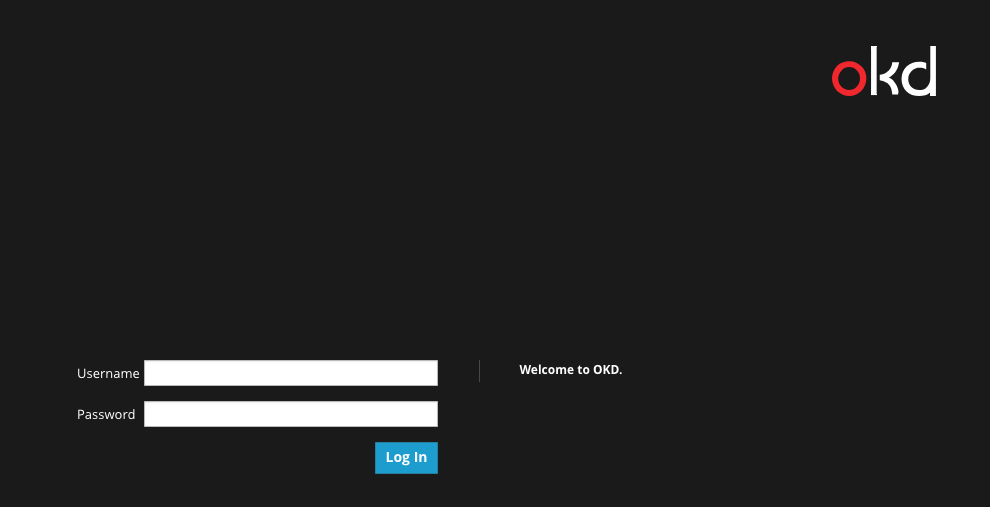
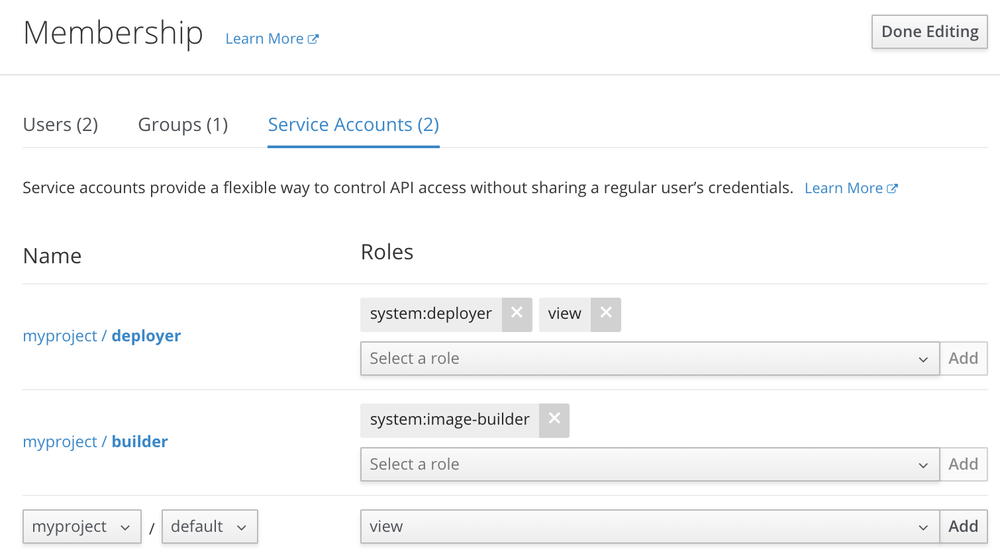

## Logging in to OpenShift

Before we get started, you need to log in to OpenShift. To log in to the OpenShift cluster used for this scenario from the _Terminal_,
run:

`odo login -u developer -p developer`{{execute}}

This will log you in using the credentials:

* **Username:** ``developer``
* **Password:** ``developer``

You should see the output below:

```
Login successful.

You have one project on this server: "default"

Using project "default".
```

Rather than using this default project, we will create a new one by running `odo project create`:

`odo project create myproject`{{execute}}

You should see the following output confirming the creation of a new OpenShift project called `myproject` and that `odo` is now using `myproject`:

```
 ✓  New project created and now using project : myproject
```

## Creating a Service Account
The backend of our application uses the OpenShift REST API. In order for the backend to access the API, we need to grant access to the service account that the backend is using. We will do this in the web console.

Click the **Dashboard** tab in the console frame of this window. This opens the OpenShift web console.

You should see an **OKD** window with **Username** and **Password** fields, which is similar to this one:



For this scenario, start by entering the following:

**Username:** ``developer``{{copy}}

**Password:** ``developer``{{copy}}

After logging in to the web console, click on the kebab (three squares) next to the project **myproject**. Click **View Membership** in the drop down that appears.


On the Membership page, click **Service Accounts** and then **Edit Membership**.

In the select boxes at the bottom, choose **myproject / default** and **view** for the role. Then click the **Add** button next to the role, and, finally, click **Done Editing** at the top of the page.



Now the service account that the backend uses has **view** access so it can retrieve objects via the API. Note that you could choose **edit** access instead. That would allow the backend to both retrieve and modify or delete objects. If you do that, you can end up destroying certain resources in the game that are not recoverable, which is why we are choosing **view** access for this scenario.
